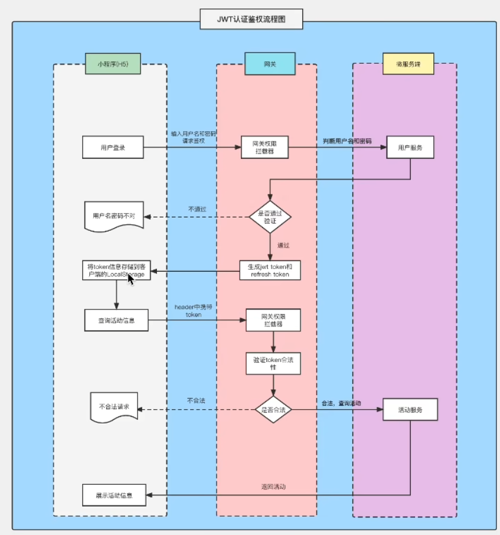
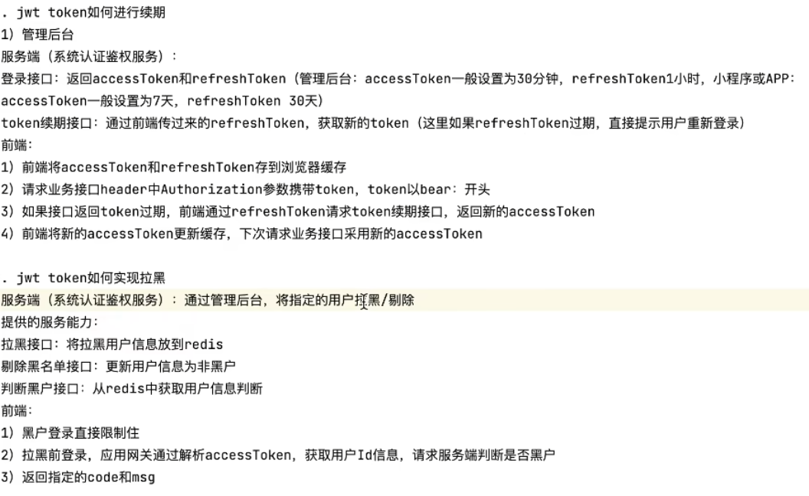

## 基于cookie-session和token的认证模式

### 用户认证

http是一个无状态的协议，一次请求结束后，下次在发送服务器就不知道这个请求是谁发来的了（同一个IP不代表同一个用户），在web应用中，用户的认知和鉴权是非常重要的一环，实践中有多种能用方案

### Cookie-session认证模式

在web应用发展初期，大部分采用基于Cookie-Session的会话管理方式，逻辑如下

- 客户端使用用户名，密码进行认证
- 服务端验证用户名，密码正确后生成并存储Session，将SessionID通过Cookie返回给客户端
- 客户端访问需要认证的接口时在Cookie中携带SessionID
- 服务器通过SessionID查找Session并进行鉴权，返回给客户端需要的数据


基于session的方式存在多种问题

- 服务器需要存储session，并且由于session需要经常快速查找，通常存储在内存或内存数据库中，同时在线用户较多时需要占用大量的服务器资源
- 当需要扩展时，创建session的服务器可能不是验证session的服务器，所以还要将所有的session单独存储共享
- 由于客户端使用cookie存储sessionID，在跨场景下需要进行兼容性处理，同时这种方式也难以防范CSRF攻击


### Token认证模式

鉴于基于session的会话管理方式存在上述多个缺点，基于Token的无状态会话管理方式诞生了，所谓无状态，就是服务器可以不再存储信息，甚至是不再存储session，逻辑如下

- 客户端使用用户名，密码进行认证
- 服务端验证用户名，密码正确后生成token返回客户端
- 客户端保存token，访问需要认证的接口在URL参数或HTTP Header中加入Token
- 服务器通过解码Token进行鉴权，返回给客户端需要的数据


基于Token会话管理方式有效解决了基于Session的会话管理方式带来的问题

- 服务端不需要存储和用户鉴权有关的信息，鉴权信息会被加密到Token中，服务端只需要读取Token中包含的鉴权信息即可
- 避免了共享Session导致的不易扩展问题
- 不需要依赖Cookie，有效避免Cookie带来的CSRF攻击问题
- 使用CORS可以快速解决跨域问题

## JWT介绍

JWT时JSON Web Token的缩写，本身是为了在网络应用环境间传递声明而执行的一种基于JSON的开放标准。JWT本身没有定义任何技术实现，它只是定义了一种基于Token的会话管理的规则，涵盖了Token需要包含的标准内容和Token的生成过程，特别适用于分布式站点的单点登陆（SSO）场景


一个JWT Token是由三部分组成

- 头部（HEADER）
- 负载  (PAYLOAD)
- 签名  (SIGNATURE)

头部和负载以JSON形式存在，这就是JWT中的JSON，三部分的内容都分别单独经过了Base64缩码，以. 拼接成一个JWT Token

### Header

JWT的Header中存储了所使用的加密算法和Token类型

```json
{	
	"alg": "HS256"
	"typ": "JWT"
}
```


### Payload

Payload表示负载，也是一个JSON对象，JWT规定了7个官方字段供选用

``` 
iss (issuer): 签发人
exp (expiratiaon time): 过期时间
sub (subject): 主题
aud (audience): 受众
nbf (Not Before): 生效时间
iat (Issued At): 签发时间
jti (JWT ID): 编号
```

除了官方字段，开发者也可以自己指定字段和内容，例如下面内容

```json
{
	"sub": "1234567890"
	"name": "John Doe"
	"admin": true
}
```

注意，JWT默认是不加密的，任何人都可以读到，所以不要把秘密信息放在这个部分。这个JSON对象也要使用Base64URL算法转成字符串

### Signature

Signature部分是对前俩个部分的签名，防止数据篡改

首先，需要指定一个密钥 (secret)。这个密钥只有服务器才知道，不能泄露给用户。然后，使用Header里面指定的签名算法 (默认是 HMAC SHA256)，按照下面公式产生签名

```
HMACSHA256(base64UrlEncode(header) + "." + base64UrlEncode(payload), secret)
```


### JWT优缺点

JWT拥有基于Token的会话管理方式所拥有的一切优势，不依赖Cookie，使得防止CSRF攻击，也能在禁用Cookie的浏览器环境中正常运行

而JWT的最大优势是服务端不再需要存储Session，使得服务端认证鉴权业务可以方便扩展，避免存储Session所需要引入的Redis等组件，降低了系统架构的复杂度。但这也是JWT最大的劣势，由于有效期存储在Token中，JWT Token一旦签发，就会在有效期内一直可用，无法在服务端废止，当用户进行登出操作，只能依赖客户端删除掉本地存储的JWT Token，如果需要禁用用户，单纯使用JWT就无法实现


### 在项目中使用JWT

我们这里使用jwt-go这个库来实现我们生成JWT和解析JWT的功能

```
package jwt

import (
	"time"

	"github.com/pkg/errors"

	"github.com/golang-jwt/jwt/v4"
)

// MyClaims 自定义声明结构体并内嵌jwt.StandardClaims
// jwt包自带的jwt.StandardClaim只包含了官方字段
// 我们这里需要额外记录一个username字段，所以要自定义结构体
// 如果想要保存更多信息，都可以添加到这个结构体中

const TokenExpireDuration = time.Hour * 2

var MySerect = []byte("月亮月亮你不懂，六便士到底有多重")

type MyClaims struct {
	UserID   int64  `json:"user_id"`
	Username string `json:"username"`
	jwt.RegisteredClaims
}

func GenToken(userID int64, username string) (string, error) {
	//创建一个我们自己声明的数据
	claims := MyClaims{
		userID,
		username, // 自定义字段
		jwt.RegisteredClaims{
			ExpiresAt: jwt.NewNumericDate(time.Now().Add(TokenExpireDuration)),
			Issuer:    "bluebell", // 签发人
		},
	}
	// 使用指定的签名方法创建签名对象
	token := jwt.NewWithClaims(jwt.SigningMethodHS256, claims)
	// 使用指定的secret签名并获得完整的编码后的字符串token
	return token.SignedString(MySerect)
}

// ParseToken 解析JWT
func ParseToken(tokenString string) (*MyClaims, error) {
	// 解析token
	// 如果是自定义Claim结构体则需要使用 ParseWithClaims 方法
	token, err := jwt.ParseWithClaims(tokenString, &MyClaims{}, func(token *jwt.Token) (i interface{}, err error) {
		// 直接使用标准的Claim则可以直接使用Parse方法
		//token, err := jwt.Parse(tokenString, func(token *jwt.Token) (i interface{}, err error) {
		return MySerect, nil
	})
	if err != nil {
		return nil, err
	}
	// 对token对象中的Claim进行类型断言
	if claims, ok := token.Claims.(*MyClaims); ok && token.Valid { // 校验token
		return claims, nil
	}
	return nil, errors.New("invalid token")
}

```


```go
const ContextUserIDKey = "userID"

// JWTAuthMiddleware 基于JWT的认证中间件
func JWTAuthMiddleware() func(c *gin.Context) {
	return func(c *gin.Context) {
		// 客户端携带Token有三种方式 1.放在请求头 2.放在请求体 3.放在URI
		// 这里假设Token放在Header的Authorization中，并使用Bearer开头
		// Authorization: Bearer xxx.xxx.xx		/ X-TOKEN: xxx.xxx.xx
		// 这里的具体实现方式要依据你的实际业务情况决定
		authHeader := c.Request.Header.Get("Authorization")
		if authHeader == "" {
			controller.ResponseError(c, controller.CodeNeedLogin)

			//Go语言的Gin框架中，c.Abort()是一个用于中断请求处理链的方法。
			//当你在中间件或处理函数中调用c.Abort()时，它会阻止后续的中间件或处理器被调用，但是它不会停止当前处理程序的执行
			//这意味着，如果在调用c.Abort()之后还有其他代码，这些代码仍然会被执行，除非跟随一个return语句来立即退出当前函数
			c.Abort()
			return
		}
		// 按空格分割
		parts := strings.SplitN(authHeader, " ", 2)
		if !(len(parts) == 2 && parts[0] == "Bearer") {
			controller.ResponseError(c, controller.CodeInvalidAuth)
			c.Abort()
			return
		}

		//第二种方式可用直接从这里开始，将前面调整取X-Token
		// parts[1]是获取到的tokenString，我们使用之前定义好的解析JWT的函数来解析它
		mc, err := jwt.ParseToken(parts[1])
		if err != nil {
			controller.ResponseError(c, controller.CodeInvalidAuth)
			c.Abort()
			return
		}
		// 将当前请求的userID信息保存到请求的上下文c上
		c.Set(ContextUserIDKey, mc.UserID)
		c.Next() // 后续的处理函数可以用过c.Get(ContextUserIDKey)来获取当前请求的用户信息
	}
}

```




