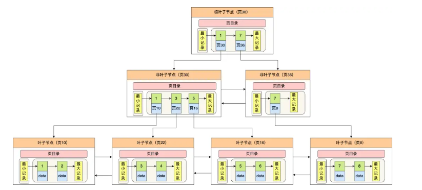
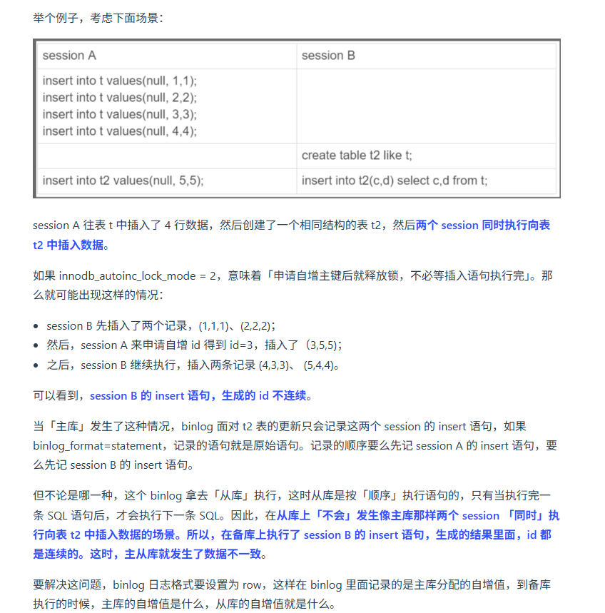

 基于小林coding的搬运，和自我的总结

# 基础篇

## 执行一条select语句，期间发生了什么？

## **MySQL****一行记录是怎么存储的？**

**MySQL****的****NULL值****是怎么存放的？**

MySQL的compact行格式会用`NULL值列表`来标记值为NULL的列，NULL值并不会存储在行格式中的真实数据部分

NULL值列表会占用1字节空间，当表中所有字段都定义为NOT NULL，行格式就不会有NULL值列表了，这样就可以节省1字节空间

**MySQL****怎么知道varchar(n)实际占用数据大小？**

MySQL的compact行格式会用`变长字段长度列表`存储变长字段实际占用的数据大小

**varchar(n)中n最大取值是多少？**

一行记录最大能存储65535字节的数据，但是这个是包含`变长字段字节数列表所占用的字节数`和`NULL值列表所占用的字节数`。所以，我们在算varchar(n)中n的最大值时，需要减去这俩个列表所占用的字节数

如果一张表只有一个varchar(n)字段，且允许为NULL，字符集为ascii。varchar(n)中n的最大取值为65532

计算公式：

```
65535-变长字段字节数列表所占用字节数-NULL值列表所占用字节数
```

65535-2-1=65532

如果有多个字段的话，要保证所有字段的长度+变长字段字节数列表所占用的字节数+NULL值列表所占用的字节数<=65535

**行溢出后，****MySQL****是怎么处理的？**

如果一个数据页存不了一条记录，InnoDB存储引擎会自动将溢出的数据存放到`溢出页`中。

Compact行格式针对行溢出的处理是这样的：当发生行溢出时，在记录的真实数据处只会保存该列的一部分数据，而把剩余的数据存放在`溢出页`中，然后真实数据处用20字节存储指向溢出页的地址，从而可以找到剩余数据所在页。

Compressed 和 Dynamic 这两种格式采用完全的行溢出方式，记录的真实数据处不会存储该列的一部分数据，只存储 20 个字节的指针来指向溢出页。而实际的数据都存储在溢出页中。

# 索引篇

## 索引常见面试题

**为什么****MySQL** **InnoDB 选择****B+tree****作为索引的数据结构？**

- B+ Tree vs B Tree
  - 存储相同数据量级别的情况下，B+Tree树高比B Tree低，磁盘I/O次数更少
  - B+Tree叶子节点用双向链表串起来，适合范围查询，B Tree无法做到这点
- B+ Tree vs 二叉树
  - 随着数据量的增加，二叉树的树高会越来越高，磁盘I/O次数会越来越多，B+Tree在千万级别的数据量下，高度依然维持在3~4层左右，也就是说一次数据查询操作只需要做3~4次的磁盘I/O操作就能查询到目标数据。
- B+Tree vs Hash
  - 虽然Hash的等值查询效率更高，但是无法做到范围查询

**什么时候适用索引？**

- 字段有唯一性限制，比如商品编码
- 经常用于WHERE查询条件的字段
- 经常用于GROUP BY和ORDER BY

**什么时候不需要创建索引**

- WHERE条件，GROUP BY，ORDER BY里用不到的字段
- 字段中存在大量重复数据，不需要创建索引
- 表数据太少的时候，不需要创建索引
- 经常更新的字段不需要创建索引

**什么时候索引会失效**

- 当我们使用左或者左右模糊匹配的时候，也就是`like%xx`或者`like%xx%`这俩种方式都会造成索引失效；
- 当我们在查询条件中对索引列做了计算，函数，类型转换操作，会导致索引失效
- 联合索引要能正确使用需要遵循最左匹配原则，也就是按照最左优先的方式进行索引的匹配，否则就会导致索引失效
- 在`WHERE`子句中，如果在`OR`前的条件列是索引列，而在`OR`后的条件列不是索引列，那么索引会失效
- 为了更好的利用索引，索引列要设置为`NOT NULL`约束

**索引优化的方法**

- 前缀索引优化
- 覆盖索引优化
- 主键索引最好是自增
- 防止索引失效

## 索引失效有哪些

- 当我们使用左或者左右模糊匹配的时候，也就是`like %xx`或者`like %xx%`这俩种方式都会造成索引失效
  -  为什么 like 关键字左或者左右模糊匹配无法走索引呢？ 
  -  因为索引 B+ 树是按照「索引值」有序排列存储的，只能根据前缀进行比较。
- 当我们在查询条件中对索引列使用函数，也会导致索引无效
- 当我们在查询条件中对索引列进行表达式计算，索引无效
- 在WHERE子句中，如果在OR前的条件列是索引列，而在OR后的条件列不是索引列，那么索引会失效
- MySQL在遇到字符串和数字比较的时候，会自动把字符串转为数字，然后再进行比较。如果字符串是索引列，而条件语句中的输入参数是数字的话，那么索引列会发生隐式类型转换，由于隐式类型转换是通过CAST函数实现，等同于对索引列使用了函数，所以就会导致索引失效

## 从数据页的角度看 B+ 树

**InnoDB是如何存储数据的**

记录是按照行来存储的，但是数据库并不以行为单位进行存储，效率太低，每次只能处理一行数据

因此，InnoDB的数据是按`数据页`为单位来读写的，也就是说，当需要读一条记录时，并不是将这个记录本身从磁盘读出来，而是以页为单位，将其整体读入内存，数据页默认大小事16KB

数据页是通过双向链表来进行存储，数据页里面的记录是按照`主键`顺序组成单向链表来进行存储

数据页中有一个页目录，起到记录索引的作用，将一个数据页里的记录分成多个组，每个记录的最后一条记录这个组的最大记录

页目录就是用来存储每组最后一条记录的地址偏移量，也被称为槽，页目录就是由多个槽组成，可以通过二分法快速定位记录在哪个槽中，然后再进行遍历这个槽的数据来查找

InnoDB 对每个分组中的记录条数都是有规定的，槽内的记录就只有几条：

-  第一个分组中的记录只能有 1 条记录； 
- 最后一个分组中的记录条数范围只能在 1-8 条之间；
-  剩下的分组中记录条数范围只能在 4-8 条之间。

**B+树是如何进行查询的**

InnoDB的B+树中每个节点都是一个数据页

但是，非叶子节点不存放数据，只有叶子节点存放数据，非叶子节点存放的是页内查询的索引值，通过索引值来进行查找，找到叶子节点的槽，进行遍历，找到叶子节点的数据



**聚簇索引和二级索引**

它们的区别在于叶子节点存放的是什么数据:

- 聚簇索引的叶子节点存放的是实际数据，所有完整的用户记录都存放在聚簇索引的叶子节点
- 二级索引的叶子节点存放的事主键值，而不是实际数据

InnoDB 在创建聚簇索引时，会根据不同的场景选择不同的列作为索引：

- 如果有主键，默认会使用主键作为聚簇索引的索引键； 
- 如果没有主键，就选择第一个不包含 NULL 值的唯一列作为聚簇索引的索引键； 
- 在上面两个都没有的情况下，InnoDB 将自动生成一个隐式自增 id 列作为聚簇索引的索引键；

  如果某个查询语句使用了二级索引，但是查询的数据不是主键值，这时在二级索引找到主键值后，需要去聚簇索引中获得数据行，这个过程就叫作「回表」，也就是说要查两个 B+ 树才能查到数据。不过，当查询的数据是主键值时，因为只在二级索引就能查询到，不用再去聚簇索引查，这个过程就叫作「索引覆盖」，也就是只需要查一个 B+ 树就能找到数据。

## 为什么MySQL会采用B+树作为索引

MySQL是会将数据持久化在硬盘，而存储功能是由MySQL存储引擎实现的，所以讨论MySQL使用哪种数据结构作为索引，实际上是讨论存储引擎使用哪种数据结构作为索引，InnoDB是MySQL默认的存储引擎，它就是采用了B+树作为索引的数据结构。

要设计一个MySQL的索引数据结构，不仅仅考虑数据结构增删改的时间复杂度，更重要的是要考虑磁盘I/O的操作次数。因为索引和记录都是存放在硬盘上的，硬盘是一个非常慢的存储设备，我们在查询数据的时候，最好能在尽可能少的磁盘I/O操作次数内完成。

B树和B+树都是通过多叉树的方式，会将树的高度变矮，所以这俩个数据结构非常适合检索存于磁盘的数据

采用B+树作为索引的原因有：

- B+树的非叶子节点不存放实际的记录数据，仅存放索引，因此数据量相同的情况下，相比存储既存索引又存记录的B树，B+树的非叶子节点可以存放更多的索引，因此B+树可以比B树更加`矮胖`,查询底层节点的磁盘I/O次数会更少
- B+树有大量冗余节点(所有非叶子节点都是冗余索引)，这些冗余索引会让B+树在插入，删除的效率更高，比如删除根节点时，不会像B树那样会发生复杂的树的变化
- B+树叶子节点之间用链表连接了起来，有利于范围查询，而B树要实现范围查询只能通过树的遍历来完成范围查询，这会涉及多个节点的磁盘I/O操作，范围查询效率不如B+树

## MySQL单表不要超过2000W行，靠谱吗？

- MySQL的表数据是以页的形式存放的，页在磁盘中不一定是连续的
- 页的空间是16k，并不是所有的空间都是用来存放数据的，会有一些固定的信息，比如：页头，页尾，页码，校验码等
- 在B+树中，叶子节点和非叶子节点的数据结构是一样的，区别在于，叶子节点存放的是实际的行数据，而非叶子节点存放的是主键和页号
- 索引结构不会影响单表最大行数，2000w也只是推荐值，超过了这个值可能会导致B+树层级更高，影响查询性能

假设 

- 非叶子节点内指向其他页的数量为 x 
- 叶子节点内能容纳的数据行数为 y 
- B+ 数的层数为 z 

Total =x^(z-1) *y 也就是说总数会等于 x 的 z-1 次方 与 Y 的乘积。

## count(*)和count(1)有什么区别？哪个性能更好

### **哪种性能更好？**

```JSON
count(*) = count(1)>count(主键字段)>count(字段)
```

count()是一个聚合函数，函数的参数不仅可以是字段名，也可以是其他任意表达式，该函数作用是统计符合查询条件的记录中，函数指定的参数不为NULL的记录有多少个

**count(主键字段)执行过程是怎样的？**

MySQLd的server层会维护一个名叫count的变量。

server层会循环读取记录，如果不为NULL，则count++

以下面语句为例：

```JSON
select count(id) from t_order;
```

如果表里只有主键索引，没有二级索引时，那么InnoDB循环遍历聚簇索引，将读取到的记录返回给server层，然后读取记录中的id值，判断是否为NULL，不为NULL，则count++

如果表里有二级索引时，InnoDB循环遍历的对象就不是聚簇索引，而是二级索引

因为在相同数量下二级索引所占用的存储空间比聚簇索引少

**count(1)执行过程是怎样的？**

以下面这条语句作为例子

```JSON
select count(1) frmo t_order;
```

只有主键索引时，InnoDB循环遍历聚簇索引，将读取到的记录返回给server层，但是不会读取记录中的任何字段的值

当有二级索引时，InnoDB循环遍历二级索引……

通过对比可以发现，count(1)比count(主键字段)少一个步骤，就是不需要读取记录中的字段值，所以count(1)执行效率比count(主键字段)高

**count(\*)其实就是相当于count(0)跟count(1)执行效率一样**

**count(字段)执行过程是怎样的？**

count(字段)执行效率是最差的，对于这个查询会采用全表扫描的方式计数，所以它的执行效率是最差的

### 为什么要通过遍历的方式来计数

InnoDB是通过count遍历来记录个数的，但MyISAM引擎是O(1)的复杂度，主要原因是MyISAM引擎维护了一个meta信息，里面存储了row_count值，由表级锁保证一致性，所以直接读取row_count值就是执行结果

而InnoDB存储引擎是支持事务的，同一时刻多个查询，由于多版本并发控制(MVCC)的原因，InnoDB表应该返回多少行是不确定的

而当带上where条件语句之后，MyISAM跟InnoDB就没有区别了，都需要扫描表来进行记录个数的统计

### 如何优化count(*)

- 近似值 当我们所需要的不是一个精确的数，而是一个近似值时，可以通过`explain`来获取表记录的估算值`rows`
- 额外表保存计数值    ---如果要获得精确值可以将计数值保存到单独一张表中

## MySQL分页有什么性能问题？怎么优化？

为了实现分页，SQL语句为：

```JSON
select * from page order by id limit offset, size;
select * from page order by id limit size;

第一页语句为：
select * from page order by id limit 0, 10;
select * from page order by id 10;
第一百页
select * from page order by id limit 990,10;
select * from page where id >= 990 limit 10;
```

> 同样都是拿10条数据，查第一页和第一百页的查询速度是一样的吗？为什么？

### 俩种limit的执行过程

上面俩种查询方式，对应`limit offset ,size`和`limit size`俩种方式

而`limit size`相当于`limit 0, size`,也就是从0开始取`size`条数据

**基于主键索引的limit执行过程**

```JSON
select * from page order by id limit 0, 10;
```

上面`select`带着*号，也就是要求获得行数据的所有字段信息

server层会调用InnoDB的接口，在InnoDB里的主键索引中获取到第0到10条完整行数据，依次返回给server层，并放到server层的结果集中，返回给客户端

当offset变大时，比如执行的是

```JSON
select * from page order by id limit 6000000, 10;
```

server层会调用InnoDB的接口，由于offest=6000000，会先在主键索引中获取从0到(6000000+10)条完整行数据，然后返回给server层之后根据offset的值挨个抛弃，最后只留下最后面的size条，放到server层的结果集中，返回给客户端

所以，mysql查询中 limit 1000,10 会比 limit 10 更慢。原因是 limit 1000,10 会先取出1000+10条数据，再抛弃前1000条，这部分耗时更大

优化方法

```JSON
select * from page where id >=(select id from page order by id limit 6000000,1) order by id limit 10;
```

优化原理，是通过二级索引，先找到第6000001个的数据的id，抛弃掉前6000000，然后再查询后10条数据，相比于之前，找到抛弃的没用的数据减少了，原先是把数据全部拿出来，再抛弃没用的，此时只拿出来id再抛弃掉没用的id

在拿到了上面的id之后，假设这个id正好等于6000000，那sql就变成了 

```JSON
select * from page where id >=(6000000) order by id limit 10;
```

**基于非主键索引的limit执行过程**

```JSON
select * from page order by user_name limit 0, 10;
```

当offest字段比较低时，非主键索引的limit执行过程，也只是比主键索引的执行过程，多了个回表操作

但是当offest字段比较大时，假设600w，此时会回600w次表，数据库会放弃掉索引，而改为全局搜索，此时非常耗费性能

优化方法：

```JSON
select * from page t1, (select id from page order by user_name limit 6000000, 100) t2 WHERE t1.id = t2.id;
```

相当于是先根据二级索引拿到6000001~6000100个字段的id值，不需要进行回表，抛弃掉不需要的前6000000个id值，然后再根据id值回表，此时只需要回表100次

但是，通过上述方法，我们还是没有解决，要查询6000000多条没用的数据，然后再抛弃的问题

此时就产生了一个非常严肃的问题`深度分页`

### 深度分页

深度分页这个问题，很恶心，是无解的

我们只能通过一些手段去“减缓”问题的严重性

**如果你是想要去除全表的数据**

直接运行

```JSON
select * from page;
```

是不行的，因为数据量较大，mysql根本没办法一次性获取全部数据

如果我们通过`limit offset size`分页的形式去分批获取，刚开始还好，但是数据一旦多了，就有可能出现深度分页问题

但这种场景也是可以解决的

我们可以将所有数据根据id主键进行排序，然后分批次取，将当前批次的最大id作为下次筛选的条件进行查询

这个操作，可以通过主键索引，每次定位到id在哪，然后往后遍历100个数据，这样不管是多少w的数据，查询性能都很稳定

**如果是给用户做分页展示**

可以控制一下数据的数量，最好不要支持跳页，这样我们就可以使用上面提到的start_id方式，采用分批获取，每批数据以start_id为起始位置，最大的好处就是不管翻到多少页，查询速度永远稳定

# 事务篇

## 事务隔离级别是怎么实现的

**事务有哪些特性？**

- 原子性：一个事务中的所有操作，要么全部完成，要么全部不完成，不会结束再中间某个环节，而且事务在执行过程中发生错误，会呗回滚到事务开始前的状态
- 一致性：是指事务操作前和操作后，数据满足完整性约束，数据库保持一致性状态
- 隔离性：数据库允许多个并发事务同时对齐数据进行读写和修改的能力，隔离性可以防止多个事务并发执行时由于交叉执行而导致数据的不一致，因为多个事务同时使用相同的数据时，不会相互干扰，每个事务都有一个完整的数据空间，对其他并发事务是隔离的
- 持久性：事务处理结束后，对数据的修改是永久性的，即便系统故障也不会丢失

是如何保证事务的四个特性的？

- 持久性是通过`redo log`(重做日志)
- 原子性是通过`undo log`(回滚日志)
- 隔离性是通过`MVCC`(多版本并发控制)或锁机制
- 一致性则是通过持久性+原子性+隔离性来保证

**并行事务会引发什么问题**

在同时处理多个事务的时候，就可能会出现脏读，不可重复读，幻读的问题

- **脏读**：如果一个事务读到了另一个未提交事务修改过的数据，就意味着发生了脏读(读到其他事务未提交的数据)
- **不可重复读**：在一个事务内多次读取同一个数据，如果出现前后俩次读到的数据不一样的情况，就意味着发生了不可重复读现象(前后读取的数据不一致)
- **幻读**：在一个事务内多次查询某个符合查询条件的记录数量，如果出现前后俩次查询到的记录数量不一样的情况，就意味着发生了幻读现象(前后读取的记录数量不一致)

**事务的隔离级别有哪些**

脏读>不可重复读>幻读

- **读未提交**:指一个事务还没提交时，它做的变更就能被其他事务看到
- **读提交**:指一个事务提交之后，它做的变更才能被其他事务看到
- **可重复读**:指一个事务执行过程中看到的数据，一直跟这个事务启动时看到的数据是一致的，`MySQL InnoDB`引擎的默认隔离级别
- **串行化**:会对记录加上读写锁，在多个事务对这条记录进行读写操作时，如果发生了读写冲突的时候，后访问的事务必须等前一个事务执行完成，才能继续执行

隔离级别：串行化>可重复读>读提交>读未提交

- 读未提交隔离级别，可能发生脏读，不可重复读和幻读现象
- 读提交隔离级别，可能发生不可重复读和幻读现象，但是不可能发生脏读现象
- 可重复读隔离级别，可能发生幻读，但不可能发生脏读和不可重复读
- 串行化隔离级别，脏读，不可重复读和幻读都不可能发生

MySQL InnoDB引擎的默认隔离级别是可重复读，但是它很大程度上避免了幻读现象(并不是完全解决)，解决方案有俩种：

- 针对**快照读**(普通select语句)，是通过**MVCC**方式解决了幻读，因为可重复读隔离级别下，事务执行过程中看到的数据，一直跟这个事务启动时看到的数据是一致的，即使途中有其他事务插入了一条数据，是查询不出来这条数据的，所以就很好的解决了这个问题
- 针对**当前读**(select ... for update 等语句)，是通过`next-key lock`(记录锁+间隙锁)方式解决了幻读，因为当执行`select ... for update`语句的时候，会加上`next-key lock`如果有其他事务在`next-key lock`锁范围内插入了一条记录，那么这个插入语句就会被阻塞，无法成功插入，所以就很好避免了幻读问题

这四种隔离级别具体是如何实现的呢？

- 对于读未提交隔离级别的事务来说，因为可以读到未提交事务修改的数据，所以直接读取最新的数据就好了
- 对于串行化隔离级别的事务来说，通过加读写锁的方式来避免并行访问
- 对于读提交和可重复读隔离级别的事务来说，它们是通过`Read View`来实现的，它们的区别在于创建`Read View`的时机不同，大家可以把`Read View`理解成一个数据快照，就像相机拍照一样，定格某一时刻的风景。读提交隔离级别是在每个语句执行前，都会重新生成一个`Read View`，而可重复读隔离级别是启动事务时生成一个`Read View`，然后整个事务期间都在用这个`Read View`

这MySQL中有俩种开启事务的命令

```JSON
begin/start transaction 命令
并不代表事务启动了，只有在执行这个命令后，执行了第一条select语句，才是事务真正的启动时机

start transaction with consistene snapshot命令
执行了这个命令，就会马上启动事务
```

**Read View在MVCC里是如何工作的？**

`Read View`中四个重要字段：

- `m_ids`:指的是在创建`Read View`时，当前数据库中活跃事务的事务id列表，注意是一个列表，活跃事务指的就是，启动了但还没提交的事务
- `min_trx_id`:指的是在创建`Read View`时，当前数据库中活跃事务中事务id最小的事务，也就是`m_ids`的最小值
- `max_trx_id`:这个并不是`m_ids`的最大值，而是创建`Read View`时当前数据库中应该给下一个事务的id值，也就是全局事务中最大的事务id值+1
- `creator_trx_id`:指的是创建该`Read View`的事务的事务id

对于使用InnoDB存储引擎的数据库表，它得聚簇索引记录中都包含俩个隐藏列：

- `trx_id` 当一个事务对某条聚簇索引记录进行改动时，就会把该事务的事务id记录在`trx_id`隐藏列里
- `roll_pointer` 每次对某条聚簇索引记录进行改动时，都会把旧版本的记录写入到`undo`日志中，然后这个隐藏列是个指针，指向每个旧版本记录

一个事务去访问记录时，除了自己的更新记录总是可见之外，还有这几种情况:

- 如果记录的`trx_id`值小于`Read View`中的`min_trx_id`值，表示这个版本的记录是在创建`Read View`前已经提交的事务生成的，所以该版本的记录对当前事务可见
- 如果记录的`trx_id`值大于等于`Read View`中的`max_trx_id`之间，需要判断`trx_id`是否在`m_ids`列表中
  - 如果记录的`trx_id`在`m_ids`列表中，表示生成该版本记录的活跃事务依然活跃着(还没提交事务)，所以该版本的记录对当前事务不可见
  - 如果记录的`trx_id`不在`m_ids`列表中，表示生成该版本记录的活跃事务已经被提交，所以该版本的记录对当前事务可见

这种通过版本链来控制并发事务访问同一记录时的行为就叫做MVCC(多版本并发控制)

**可重复读是如何工作的？**

可重复读隔离级别是启动事务时生成一个Read View，然后整个事务期间都在用这个Read View

**读提交是如何工作的？** 

读提交隔离级别是在每次读取数据时，都会生成一个新的 Read View。

## MySQL可重复读隔离级别，完全解决幻读了吗？

**什么是幻读？**

当同一个查询在不同的时间产生不同的结果集时，事务中就会出现所谓幻象问题

举个例子，假设一个事务在T1时刻和T2时刻分别执行了下面查询语句，途中没有执行其他任何语句：

```SQL
select * from t_test where id > 100;
```

只要T1和T2时刻执行产生的结果集时不相同的，那就发生了幻读问题

**快照读是如何避免幻读的？**

可重复读隔离级是由MVCC实现的，实现的方式是开始事务后(执行begin语句后)，在执行第一个查询语句后，会创建一个Read View，**后续的查询语句利用这个Read View，通过这个Read View就可以在undo log版本链找到事务开始时的数据，所以事务过程中每次查询的数据都是一样的**，即使中途有其他事务插入了新记录，是查询不出来这条数据的，所以就很好的避免了幻读问题

**当前读是如何避免幻读的**

MySQL里除了普通查询是快照读，其他都是当前读，比如update、insert、delete，这些语句执行前都会查询最新版本的数据，然后再做进一步的操作

为了解决可重复读隔离级别使用当前读而造成的幻读问题，就引出了间隙锁

```SQL
begin;
select name form t_stu where id >2 for update;
此时就会有间隙锁，来锁住 id>2的行数

begin;
insert into t_stu values(5,"yuxiay",100);
阻塞
```

**幻读被完全解决了吗？**

可重复读隔离级别下虽然很大程度上避免了幻读，但是还是没有能完全解决幻读

- **第一个发生幻读现象的场景**

```SQL
// 数据库中本来没有id=5的数据
// 事务A
begin;
select * from t_stu where id =5;    // 此时数据库中是无法查到id=5的数据

// 事务B
begin;
insert into t_stu values(5,'小美',18);
commit;
```

此时，事务A更新id=5这条记录(事务A看不到id = 5这条记录，但是他去更新了这条记录)，然后再次查询id=5的记录，事务A就能看到B插入的记录了

```SQL
// 事务A
update t_stu set name = 'yuxiay' where id = 5;
select * from t_stu where id = 5;
```

在可重复读隔离级别下，事务A第一次执行普通的`select`语句时生成了一个Read View ，之后事务B向表中新插入了一条id = 5 的记录并提交。接着，事务A对id = 5 这条记录进行了更新操作，在这个时刻，这条新纪录的trx_id隐藏列的值就变成了事务A的事务id，之后事务A再使用普通`select`语句去查询这条记录时就可以看到这条记录了，于是就发生了幻读

- **第二个发生幻读的场景**
  - T1时刻：事务A先执行快照读语句`select * from t_test where id>100`获得了3条记录。
  - T2时刻：事务B插入了一个id=200的记录并提交
  - T3时刻：事务A再执行当前读语句`select * from t_test where id >100 for update` 就会得到4条记录，此时发生了幻读

要避免这类特殊场景下发生幻读的话，就是尽量在开启事务之后，马上执行`select ... for update`这类当前读的语句，因为它会对记录价`next-key lock`，从而避免其他事务插入一条新记录

# 锁篇

## MySQL有哪些锁

### 全局锁

**全局锁是怎么用的？**

```SQL
flush tables with read lock
```

执行后，整个数据库就处于只读状态，这时其他线程执行以下操作，都会被阻塞:

- 对数据的增删改操作，比如`insert`、`delete`、`update`等语句
- 对表结构的更改操作，比如`alter table`、`drop table`等语句

如果要释放全局锁，则要执行

```SQL
unlock tables
```

**全局锁应用场景是什么？**

全局锁主要应用于做全库逻辑备份，这样在备份数据库期间，不会因为数据或表结构的更新，而出现备份文件的数据与预期的不一样。

**加全局锁又会带来什么缺点？**

加上全局锁意味着整个数据库都是只读状态

那么如果数据库里有很多数据，备份就会花费很多时间，关键是备份期间，业务只能读数据，而不能更新数据，这样会造成业务停滞

**既然备份数据库数据的时候，使用全局锁会影响业务，那有什么其他方式可以避免**

如果数据库的引擎支持的事务支持可重复读的隔离级别，那么在备份数据库之前开启事务，会先创建Read View，然后整个事务执行期间都在用这个Read View，而且由于MVCC的支持，备份期间业务依然可以对数据进行更新操作

### 表级锁

**MySQL表级锁有哪些，具体怎么用**

表锁，元数据锁，意向锁，AUTO-INC锁

**表锁**

对学生表加表锁，可以使用

```SQL
// 表级别的共享锁，也就是读锁
// 允许当前会话读取被锁定的表，但阻止其他会话对这些表进行写操作
lock tables t_student read;

// 表级别的独占锁，也就是写锁
// 允许当前会话对表进行读写操作，但阻止其他会话对这些表进行任何操作(读或写)
lock tables t_student write;
```

当线程A执行 `LOCK TABLES t1 READ, t2 WRITE`后：

| 操作类型       | t1(READ锁)               | t2(WRITE锁)          |
| -------------- | ------------------------ | -------------------- |
| 其他会话读操作 | ✅ 允许（无需加锁）       | ❌ 阻塞（直到锁释放） |
| 其他会话写操作 | ❌ 阻塞（等待READ锁释放） | ❌ 阻塞（直到锁释放） |

线程A在未解锁前只能访问已锁定的表（`t1`和 `t2`），且操作权限受锁类型限制：

| 操作类型 | t1(READ锁) | t2(WRITE锁) | 其他表（如 t3） |
| -------- | ---------- | ----------- | --------------- |
| 读取数据 | ✅ 允许     | ✅ 允许      | ❌ 禁止访问      |
| 写入数据 | ❌ 禁止     | ✅ 允许      | ❌ 禁止访问      |

**元数据锁(MDL)**

我们不需要显示的使用MDL，因为当我们对数据库表进行操作时，会自动给这个表加上MDL：

- 对一张表进行CRUD操作时，加的是MDL读锁
- 对一张表做结构变更操作时，加的是MDL写锁

> MDL不需要显示调用，那么它是什么时候释放的？

MDL是在事务提交后才会释放，这意味着事务执行期间，MDL是一直持有的

那如果数据库有一个长事务（所谓的长事务，就是开启了事务，但是一直还没提交），那在对表结构做变更操作的时候，可能会发生意想不到的事情，比如下面这个顺序的场景：

1. 首先，线程 A 先启用了事务（但是一直不提交），然后执行一条 select 语句，此时就先对该表加上 MDL 读锁； 
2. 然后，线程 B 也执行了同样的 select 语句，此时并不会阻塞，因为「读读」并不冲突； 
3. 接着，线程 C 修改了表字段，此时由于线程 A 的事务并没有提交，也就是 MDL 读锁还在占用着，这时线程 C 就无法申请到 MDL 写锁，就会被阻塞，

那么在线程C阻塞后，后续有对该表的`select`语句，就都会被阻塞，如果此时有大量该表的`select`语句的请求到来，就会有大量的线程被阻塞住，这是数据库的线程很快就会爆满

> 为什么线程C因为申请不到MDL写锁，而导致后续的申请读锁的查询操作也会被阻塞？

这是因为申请MDL锁的操作会形成一个队列，队列中**写锁获取优先级高于读锁**，一旦出现了MDL写锁等待，就会阻塞后续该表的所有CRUD操作

所以为了能安全的对表结构进行变更，在对表结构变更前，先要看看看数据库中的长事务，是否有事务已经对表加上了MDL读锁，如果可以考虑kill掉这个长事务，然后再做表结构的变更

**意向锁**

- 在使用InnoDB引擎的表里对某些记录加上共享锁之前，需要先在表级别加上一个意向共享锁
- 在使用InnoDB引擎的表里对某些记录加上独占锁之前，需要先在表级别加上一个意向独占锁

也就是说，当执行插入，更新，删除操作时，需要先对表加上意向独占锁，然后对该记录加上独占锁

而普通的`select`是不会加行级锁的，普通的`select`语句是利用MVCC实现一致性读的，是无锁的

但是，`select`也是可以对记录加共享锁和独占锁的，具体方式如下：

```SQL
// 先在表上加上意向共享锁，然后对读取的记录加共享锁
select ... lock in share mode;

// 先在表上加上意向独占锁，然后对读取的记录加独占锁
select ... for update;
```

意向共享锁和意向独占锁是表级锁，不会和行级的共享锁和独占锁发生冲突，而且意向锁之间也不会发生冲突，只会和共享表锁(`lock tables ... read`)和独占表锁(`lock tables ... write`)发生冲突

意向锁的目的是为了快速判断表里是否有记录被加锁

**AUTO-INC锁**

表里的主键通常都会设置成自增的，这是通过对主键字段声明`AUTO_INCREMENT`属性实现的，之后可以在插入数据时，可以不指定主键的值，数据库会自动给主键赋值递增的值，这主要是通过`AUTO-INC`锁来实现的

AUTO-INC锁是特殊的表锁机制，锁**不是在一个事务提交后才释放，而是在执行完插入语句后就会立即释放**

在插入数据时，会加一个表级别的AUTO-INC锁，然后为被`AUTO_INCREMENT`修饰的字段赋值递增的值，等插入语句执行完成后，才会吧AUTO-INC锁释放掉

因此， 在 MySQL 5.1.22 版本开始，InnoDB 存储引擎提供了一种轻量级的锁来实现自增。

 一样也是在插入数据的时候，会为被 AUTO_INCREMENT 修饰的字段加上轻量级锁，然后给该字段赋值一个自增的值，就把这个轻量级锁释放了，而不需要等待整个插入语句执行完后才释放锁。 

InnoDB 存储引擎提供了个 innodb_autoinc_lock_mode 的系统变量，是用来控制选择用 AUTO-INC 锁，还是轻量级的锁。 

- 当 innodb_autoinc_lock_mode = 0，就采用 AUTO-INC 锁，语句执行结束后才释放锁； 
- 当 innodb_autoinc_lock_mode = 2，就采用轻量级锁，申请自增主键后就释放锁，并不需要等语句执行后才释放。
-  当 innodb_autoinc_lock_mode = 1： 普通 insert 语句，自增锁在申请之后就马上释放； 类似 insert … select 这样的批量插入数据的语句，自增锁还是要等语句结束后才被释放；

 当 innodb_autoinc_lock_mode = 2 是性能最高的方式，但是当搭配 binlog 的日志格式是 statement 一起使用的时候，在「主从复制的场景」中会发生数据不一致的问题。



### 行级锁

InnoDB引擎支持行级锁，而MyISAM引擎不支持行级锁

普通的select语句不会对记录加锁，因为它属于快照读，如果要在查询时对记录加行锁，可以用下面方式，这种查询会加锁的语句成为锁定读

```SQL
// 对读取的记录加共享锁
select ... lock in share mode;

// 对读取的记录加独占锁
select ... for update
```

上面这俩条语句必须在一个事务中，因为当事务提交了，锁就会被释放，所以在使用这俩条语句的时候，要加上`begin`、`start transaction`或者`set autocommit=0`

共享锁(S锁)满足读读共享，读写互斥，独占锁(X锁)满足写写互斥，读写互斥

行级锁的类型主要有三类：

- `Record Lock`，记录锁，也就是仅仅把一条记录锁上
- `Gap Lock`，间隙锁，锁定一个范围，但是不包含记录本身
- `Next-Key Lock`，`Record Lock + Gap Lock`的组合，锁定一个范围，并锁定记录本身

**Record Lock**

Record Lock 称为记录锁，锁住的是一条记录，而且记录锁是有S锁和X锁之分的

- 当一个事务对一条记录加了S型记录锁之后，其他事务也可以继续对该记录加S型记录锁(S型与S型兼容)，但是不可以对该记录加X型记录锁(S型与X型不兼容)
- 当一个事务对一条记录加了X型记录锁之后，其他事务既不可以对该记录加S型锁(S型与X型不兼容)，也不可以对该记录加X型记录锁(X型与X型不兼容)

```SQL
begin;
select * from t_test where id = 1 for update;
```

就是对t_test表中主键`id = 1`的这条记录加上X型的记录锁，这样其他事务就无法对这条记录进行修改了

当事务执行`commit`后，事务过程中生成的锁都会被释放

**Gap Lock**

Gap Lock 称为间隙锁，存在于可重复读隔离级别和串行化隔离级别，目的是为了解决可重复读隔离级别下的幻读现象

假设，表中有一个范围id为(3,5)间隙锁，那么其他事务就无法插入id=4这条记录，这样就有效的防止幻读现象发生

间隙锁虽然存在X型和S型，但是病没有什么区别，间隙锁之间是兼容的，即俩个事务可以同时持有包含共同间隙范围的间隙锁，并不存在互斥关系，因为间隙锁的目的是防止插入幻影记录而提出的

**Next-Key Lock**

Next-Key Lock 称为临键锁，是`Record Lock + Gap Lock`的组合，锁定一个范围，并且锁定记录本身

假设，表中有一个范围id为(3,5]的next-key lock，那么其他事务既不能插入id=4记录，也不能修改id=5这条记录

所以，next-key lock是包含间隙锁+记录锁的，如果一个事务获取了X型的next-key lock，那么另外一个事务在获取相同范围的X型的next-key lock 时，是会被阻塞的

比如，一个事务持有了范围为(1,10]的X型的next-key lock ,那么另外一个事务在获取相同范围的X型的next-key lock时，就会被阻塞

**插入意向锁**

一个事务在插入一条记录的时候，需要判断插入位置是否已经被其他事务加了间隙锁(next-key lock也包含间隙锁)

如果有的话，插入操作就会发生阻塞，知道拥有间隙锁的那个事务提交为止(释放间隙锁的时刻)，在此期间会生成一个插入意向锁，表明有事务想在某个区间插入新记录，但是现在处于等待状态

举个例子，假设事务A已经对表加了一个范围id为(3,5)间隙锁

当事务A还没提交的时候，事务B向该表插入了一条id=4的新记录，这时会判断到插入的位置已经被事务A加了间隙锁，于是事务B会生成一个插入意向锁，然后将锁的状态设置为等待状态(PS：MySQL加锁时，是先生成锁结构，然后设置锁的状态，如果锁状态是等待状态，并不是意味着事务成功获取到了锁，只有当锁状态为正常状态时，才代表事务成功获取到了锁)，此时事务B就会发生阻塞，直到事务A提交了事务

## MySQL是怎么加锁的？

**什么SQL语句会加行级锁**

普通的select语句是不会对记录加锁的(除了串行化隔离级别)，因为它属于快照读，是通过MVCC(多版本并发控制)实现的

如果要在查询时对记录加行级锁，可以使用下面这俩个方式，这俩种查询会加锁的语句成为锁定读

```SQL
// 对读取的记录加共享锁
select ... lock in share mode;

// 对读取的记录加独占锁
select ... for update
```

上面这俩条语句必须在一个事务中，因为当事务提交了，锁就会被释放，所以在使用这俩个语句的时候，要加上`begin`或者`start transaction`开启事务的语句

除了上面这俩条锁定读语句会加行级锁之外，`update`和`delete`操作都会加行级锁，且锁的类型都是独占锁

```SQL
// 对操作的记录加独占锁
update table ... where id = 1

// 对操作的记录加独占锁
delete from table where id = 1

// 对操作的记录加间隙锁(Gap Lock)和临建锁(Next-Key Lock) 独占锁
insert ... from
```

**MySQL是怎么加行级锁的？**

加锁的对象是索引，加锁的基本单位是`next-key lock`，它是由记录锁和间隙锁组合而成的，`next-key lock`是前开后闭区间，而间隙锁是前开后开区间

在能使用记录锁或者间隙锁就能避免幻读现象的场景下，`next-key lock`就会退化成记录锁或间隙锁

- **唯一索引(主键索引)等值查询**
  - 当查询的记录是存在的，在索引树上定位到这一条记录后，将该记录的索引中的`next-key lock`退化成记录锁
  - 当查询的记录是不存在的，在索引树找到第一条大于该查询记录的记录后，将该记录的索引中的`next-key lock`会退化成间隙锁

```SQL
select * from performance_schema.data_locks\G;
```

- **唯一索引(主键索引)范围查询**
  -  当唯一索引进行范围查询时，会对每一个扫描到的索引加`next-key lock`，然后如果遇到下面这些情况，会退化成记录锁或者间隙锁
  - 情况一：针对大于等于的范围查询，因为存在等值查询条件，那么如果等值查询的记录存在于表中，那么该记录的索引中的`next-key`锁会退化成记录锁
  - 情况二：针对小于或者小于等于的范围查询，要看条件值的记录是否存在于表中：
    - 当条件值的记录不在表中，那么不管是小于还是小于等于条件的范围查询，扫描到终止范围查询的记录时，该记录索引的`next-key`锁会退化成间隙锁，其他扫描到的记录，都是在这些记录的索引上加`next-key`锁
    - 当条件值记录在表中，如果是小于条件的范围查询，扫描到终止范围查询的记录时，该记录随你的`next-key lock`会退化成间隙锁，其他扫描到的记录，都是在这些记录索引上加`next-key`锁；如果是小于等于条件的范围查询，扫描到终止范围查询的记录时，该记录的索引`next-key lock`不会退化成间隙锁，其他扫描到的记录，都是在这些记录的索引上加`next-key lock`
