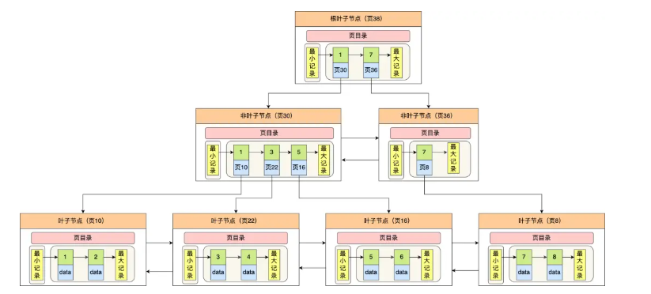

 基于小林coding的搬运，和自我的总结

# 基础篇

## 执行一条select语句，期间发生了什么？

## MySQL一行记录是怎么存储的？

**MySQL的NULL值是怎么存放的？**

MySQL的compact行格式会用`NULL值列表`来标记值为NULL的列，NULL值并不会存储在行格式中的真实数据部分

NULL值列表会占用1字节空间，当表中所有字段都定义为NOT NULL，行格式就不会有NULL值列表了，这样就可以节省1字节空间

**MySQL****怎么知道varchar(n)实际占用数据大小？**

MySQL的compact行格式会用`变长字段长度列表`存储变长字段实际占用的数据大小

**varchar(n)中n最大取值是多少？**

一行记录最大能存储65535字节的数据，但是这个是包含`变长字段字节数列表所占用的字节数`和`NULL值列表所占用的字节数`。所以，我们在算varchar(n)中n的最大值时，需要减去这俩个列表所占用的字节数

如果一张表只有一个varchar(n)字段，且允许为NULL，字符集为ascii。varchar(n)中n的最大取值为65532

计算公式：

```
65535-变长字段字节数列表所占用字节数-NULL值列表所占用字节数
```

65535-2-1=65532

如果有多个字段的话，要保证所有字段的长度+变长字段字节数列表所占用的字节数+NULL值列表所占用的字节数<=65535

**行溢出后，MySQL是怎么处理的？**

如果一个数据页存不了一条记录，InnoDB存储引擎会自动将溢出的数据存放到`溢出页`中。

Compact行格式针对行溢出的处理是这样的：当发生行溢出时，在记录的真实数据处只会保存该列的一部分数据，而把剩余的数据存放在`溢出页`中，然后真实数据处用20字节存储指向溢出页的地址，从而可以找到剩余数据所在页。

Compressed 和 Dynamic 这两种格式采用完全的行溢出方式，记录的真实数据处不会存储该列的一部分数据，只存储 20 个字节的指针来指向溢出页。而实际的数据都存储在溢出页中。

# 索引篇

## 索引常见面试题

**为什么MySQL InnoDB 选择B+tree作为索引的数据结构？**

- B+ Tree vs B Tree
  - 存储相同数据量级别的情况下，B+Tree树高比B Tree低，磁盘I/O次数更少
  - B+Tree叶子节点用双向链表串起来，适合范围查询，B Tree无法做到这点
- B+ Tree vs 二叉树
  - 随着数据量的增加，二叉树的树高会越来越高，磁盘I/O次数会越来越多，B+Tree在千万级别的数据量下，高度依然维持在3~4层左右，也就是说一次数据查询操作只需要做3~4次的磁盘I/O操作就能查询到目标数据。
- B+Tree vs Hash
  - 虽然Hash的等值查询效率更高，但是无法做到范围查询

**什么时候适用索引？**

- 字段有唯一性限制，比如商品编码
- 经常用于WHERE查询条件的字段
- 经常用于GROUP BY和ORDER BY

**什么时候不需要创建索引**

- WHERE条件，GROUP BY，ORDER BY里用不到的字段
- 字段中存在大量重复数据，不需要创建索引
- 表数据太少的时候，不需要创建索引
- 经常更新的字段不需要创建索引

**什么时候索引会失效**

- 当我们使用左或者左右模糊匹配的时候，也就是`like%xx`或者`like%xx%`这俩种方式都会造成索引失效；
- 当我们在查询条件中对索引列做了计算，函数，类型转换操作，会导致索引失效
- 联合索引要能正确使用需要遵循最左匹配原则，也就是按照最左优先的方式进行索引的匹配，否则就会导致索引失效
- 在`WHERE`子句中，如果在`OR`前的条件列是索引列，而在`OR`后的条件列不是索引列，那么索引会失效
- 为了更好的利用索引，索引列要设置为`NOT NULL`约束

**索引优化的方法**

- 前缀索引优化
- 覆盖索引优化
- 主键索引最好是自增
- 防止索引失效

## 索引失效有哪些

- 当我们使用左或者左右模糊匹配的时候，也就是`like %xx`或者`like %xx%`这俩种方式都会造成索引失效
  -  为什么 like 关键字左或者左右模糊匹配无法走索引呢？ 
  -  因为索引 B+ 树是按照「索引值」有序排列存储的，只能根据前缀进行比较。
- 当我们在查询条件中对索引列使用函数，也会导致索引无效
- 当我们在查询条件中对索引列进行表达式计算，索引无效
- 在WHERE子句中，如果在OR前的条件列是索引列，而在OR后的条件列不是索引列，那么索引会失效
- MySQL在遇到字符串和数字比较的时候，会自动把字符串转为数字，然后再进行比较。如果字符串是索引列，而条件语句中的输入参数是数字的话，那么索引列会发生隐式类型转换，由于隐式类型转换是通过CAST函数实现，等同于对索引列使用了函数，所以就会导致索引失效

## 从数据页的角度看 B+ 树

**InnoDB是如何存储数据的**

记录是按照行来存储的，但是数据库并不以行为单位进行存储，效率太低，每次只能处理一行数据

因此，InnoDB的数据是按`数据页`为单位来读写的，也就是说，当需要读一条记录时，并不是将这个记录本身从磁盘读出来，而是以页为单位，将其整体读入内存，数据页默认大小事16KB

数据页是通过双向链表来进行存储，数据页里面的记录是按照`主键`顺序组成单向链表来进行存储

数据页中有一个页目录，起到记录索引的作用，将一个数据页里的记录分成多个组，每个记录的最后一条记录这个组的最大记录

页目录就是用来存储每组最后一条记录的地址偏移量，也被称为槽，页目录就是由多个槽组成，可以通过二分法快速定位记录在哪个槽中，然后再进行遍历这个槽的数据来查找

InnoDB 对每个分组中的记录条数都是有规定的，槽内的记录就只有几条：

-  第一个分组中的记录只能有 1 条记录； 
- 最后一个分组中的记录条数范围只能在 1-8 条之间；
-  剩下的分组中记录条数范围只能在 4-8 条之间。

**B+树是如何进行查询的**

InnoDB的B+树中每个节点都是一个数据页

但是，非叶子节点不存放数据，只有叶子节点存放数据，非叶子节点存放的是页内查询的索引值，通过索引值来进行查找，找到叶子节点的槽，进行遍历，找到叶子节点的数据



**聚簇索引和二级索引**

它们的区别在于叶子节点存放的是什么数据:

- 聚簇索引的叶子节点存放的是实际数据，所有完整的用户记录都存放在聚簇索引的叶子节点
- 二级索引的叶子节点存放的事主键值，而不是实际数据

InnoDB 在创建聚簇索引时，会根据不同的场景选择不同的列作为索引：

- 如果有主键，默认会使用主键作为聚簇索引的索引键； 
- 如果没有主键，就选择第一个不包含 NULL 值的唯一列作为聚簇索引的索引键； 
- 在上面两个都没有的情况下，InnoDB 将自动生成一个隐式自增 id 列作为聚簇索引的索引键；

  如果某个查询语句使用了二级索引，但是查询的数据不是主键值，这时在二级索引找到主键值后，需要去聚簇索引中获得数据行，这个过程就叫作「回表」，也就是说要查两个 B+ 树才能查到数据。不过，当查询的数据是主键值时，因为只在二级索引就能查询到，不用再去聚簇索引查，这个过程就叫作「索引覆盖」，也就是只需要查一个 B+ 树就能找到数据。

## 为什么MySQL会采用B+树作为索引

MySQL是会将数据持久化在硬盘，而存储功能是由MySQL存储引擎实现的，所以讨论MySQL使用哪种数据结构作为索引，实际上是讨论存储引擎使用哪种数据结构作为索引，InnoDB是MySQL默认的存储引擎，它就是采用了B+树作为索引的数据结构。

要设计一个MySQL的索引数据结构，不仅仅考虑数据结构增删改的时间复杂度，更重要的是要考虑磁盘I/O的操作次数。因为索引和记录都是存放在硬盘上的，硬盘是一个非常慢的存储设备，我们在查询数据的时候，最好能在尽可能少的磁盘I/O操作次数内完成。

B树和B+树都是通过多叉树的方式，会将树的高度变矮，所以这俩个数据结构非常适合检索存于磁盘的数据

采用B+树作为索引的原因有：

- B+树的非叶子节点不存放实际的记录数据，仅存放索引，因此数据量相同的情况下，相比存储既存索引又存记录的B树，B+树的非叶子节点可以存放更多的索引，因此B+树可以比B树更加`矮胖`,查询底层节点的磁盘I/O次数会更少
- B+树有大量冗余节点(所有非叶子节点都是冗余索引)，这些冗余索引会让B+树在插入，删除的效率更高，比如删除根节点时，不会像B树那样会发生复杂的树的变化
- B+树叶子节点之间用链表连接了起来，有利于范围查询，而B树要实现范围查询只能通过树的遍历来完成范围查询，这会涉及多个节点的磁盘I/O操作，范围查询效率不如B+树

## MySQL单表不要超过2000W行，靠谱吗？

- MySQL的表数据是以页的形式存放的，页在磁盘中不一定是连续的
- 页的空间是16k，并不是所有的空间都是用来存放数据的，会有一些固定的信息，比如：页头，页尾，页码，校验码等
- 在B+树中，叶子节点和非叶子节点的数据结构是一样的，区别在于，叶子节点存放的是实际的行数据，而非叶子节点存放的是主键和页号
- 索引结构不会影响单表最大行数，2000w也只是推荐值，超过了这个值可能会导致B+树层级更高，影响查询性能

假设 

- 非叶子节点内指向其他页的数量为 x 
- 叶子节点内能容纳的数据行数为 y 
- B+ 数的层数为 z 

Total =x^(z-1) *y 也就是说总数会等于 x 的 z-1 次方 与 Y 的乘积。

## count(*)和count(1)有什么区别？哪个性能更好

**哪种性能更好？**

count()是一个聚合函数，函数的参数不仅可以是字段名，也可以是其他任意表达式，该函数作用是统计符合查询条件的记录中，函数指定的参数不为NULL的记录有多少个

