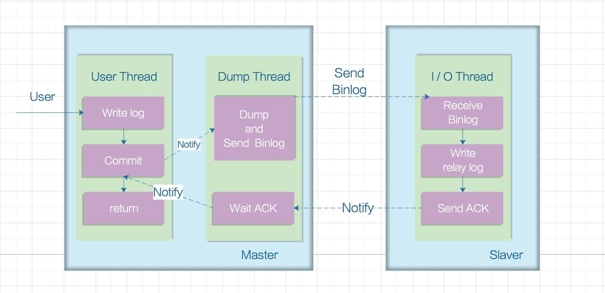

#  Mysql主从复制

* MySQL主从复制是一个异步的复制过程，底层是基于Mysql数据库自带的 **binlog** 功能。就是一台或多台MySQL数据库 从另一台MySQL数据库进行日志的复制，然后再解析日志并应用到自身，最终实现 **从库** 的数据和 **主库** 的数据保持一致。
* binlog记录了所有的 DDL（数据定义语言）语句和 DML（数据操纵语言）语句，但是不包括数据查询语句。此日志对于灾难时的数据恢复起着极其重要的作用。
* mysql默认未开启binlog，所以部署mysql的时候，配置文件需要开启binlog

主库会生成一个 log dump 线程,用来给从库 I/O 线程传 Binlog 数据。

从库的 I/O 线程会去请求主库的 Binlog，并将得到的 Binlog 写到本地的 relay log (中继日志)文件中。

SQL 线程,会读取 relay log 文件中的日志，并解析成 SQL 语句逐一执行。

## 复制过程

**MySQL主从复制的两种情况：同步复制和异步复制，实际复制架构中大部分为异步复制。**

MySQL 主从复制默认是 **异步的模式**。MySQL增删改操作会全部记录在 Binlog 中，当 slave 节点连接 master 时，会主动从 master 处获取最新的 Binlog 文件。并把 Binlog 存储到本地的 relay log 中，然后去执行 relay log 的更新内容。

从服务器 I/O 线程将主服务器的 Binlog 日志读取过来，解析到各类 Events 之后记录到从服务器本地文件，这个文件就被称为 relay log。然后 SQL 线程会读取 relay log 日志的内容并应用到从服务器，从而使从服务器和主服务器的数据保持一致。relay log充当缓冲区，这样 master 就不必等待 slave 执行完成才发送下一个事件。

## 主流模型

## 主从复制的模式

**异步模式**

这种模式下，主节点不会主动推送bin-log到从节点，主库在执行完客户端提交的事务后会立即将结果返给给客户端，并不关心从库是否已经接收并处理，这样就会有一个问题，主节点如果崩溃掉了，此时主节点上已经提交的事务可能并没有传到从节点上，如果此时，强行将从提升为主，可能导致新主节点上的数据不完整。

**半同步模式**

介于异步复制和全同步复制之间，主库在执行完客户端提交的事务后不是立刻返回给客户端，而是等待至少一个从库接收到并写到relay-log中才返回成功信息给客户端（只能保证主库的bin-log至少传输到了一个从节点上，但并不能保证从节点将此事务执行更新到db中），否则需要等待直到超时时间然后切换成异步模式再提交。相对于异步复制，半同步复制提高了数据的安全性，一定程度的保证了数据能成功备份到从库，同时它也造成了一定程度的延迟，但是比全同步模式延迟要低，这个延迟最少是一个TCP/IP往返的时间。所以，半同步复制最好在低延时的网络中使用。

**全同步模式**

指当主库执行完一个事务，然后所有的从库都复制了该事务并成功执行完才返回成功信息给客户端。因为需要等待所有从库执行完该事务才能返回成功信息，所以全同步复制的性能必然会收到严重的影响。

**Slave 同步延迟**

因为 Slave 端是通过 I/O thread 单线程来实现数据解析入库；而 Master 端写 Binlog 由于是顺序写效率很高，当主库的 TPS 很高的时候，必然 Master 端的写效率要高过 Slave 端的读效率，这时候就有同步延迟的问题。

##  实现

> 这里我们不实际部署主从模式

配置：

~~~yaml
db:
  separation: true
  master:
    name: master
    username: root
    password: root
    host: 127.0.0.1
    port: 3309
    db: msproject
  slave:
    - username: root
      password: root
      host: 127.0.0.1
      port: 3309
      db: msproject_slave1
      name: slave1
    - username: root
      password: root
      host: 127.0.0.1
      port: 3309
      db: msproject_slave1
      name: slave2
~~~

~~~go
func (c *Config) InitDbConfig() {
	mc := DbConfig{}
	mc.Separation = c.viper.GetBool("db.separation")
	var slaves []MysqlConfig
	err := c.viper.UnmarshalKey("db.slave", &slaves)
	if err != nil {
		panic(err)
	}
	master := MysqlConfig{
		Username: c.viper.GetString("db.master.username"),
		Password: c.viper.GetString("db.master.password"),
		Host:     c.viper.GetString("db.master.host"),
		Port:     c.viper.GetInt("db.master.port"),
		Db:       c.viper.GetString("db.master.db"),
	}
	mc.Master = master
	mc.Slave = slaves
	c.DbConfig = mc
}

~~~

~~~go
go get gorm.io/plugin/dbresolver
~~~

~~~go
package gorms

import (
	"context"
	"fmt"
	"gorm.io/driver/mysql"
	"gorm.io/gorm"
	"gorm.io/gorm/logger"
	"gorm.io/plugin/dbresolver"
	"test.com/project-project/config"
)

var _db *gorm.DB

func init() {
	if config.C.DbConfig.Separation {
		//读写分离配置
		username := config.C.DbConfig.Master.Username //账号
		password := config.C.DbConfig.Master.Password //密码
		host := config.C.DbConfig.Master.Host         //数据库地址，可以是Ip或者域名
		port := config.C.DbConfig.Master.Port         //数据库端口
		Dbname := config.C.DbConfig.Master.Db         //数据库名
		dsn := fmt.Sprintf("%s:%s@tcp(%s:%d)/%s?charset=utf8&parseTime=True&loc=Local", username, password, host, port, Dbname)
		var err error
		_db, err = gorm.Open(mysql.Open(dsn), &gorm.Config{
			Logger: logger.Default.LogMode(logger.Info),
		})
		if err != nil {
			panic("连接数据库失败, error=" + err.Error())
		}
		replicas := []gorm.Dialector{}
		for _, v := range config.C.DbConfig.Slave {
			username := v.Username //账号
			password := v.Password //密码
			host := v.Host         //数据库地址，可以是Ip或者域名
			port := v.Port         //数据库端口
			Dbname := v.Db         //数据库名
			dsn := fmt.Sprintf("%s:%s@tcp(%s:%d)/%s?charset=utf8&parseTime=True&loc=Local", username, password, host, port, Dbname)
			cfg := mysql.Config{
				DSN: dsn,
			}
			replicas = append(replicas, mysql.New(cfg))
		}
		_db.Use(dbresolver.Register(dbresolver.Config{
			Sources: []gorm.Dialector{mysql.New(mysql.Config{
				DSN: dsn,
			})},
			Replicas: replicas,
			Policy:   dbresolver.RandomPolicy{},
		}).
			SetMaxIdleConns(10).
			SetMaxOpenConns(200))
	} else {
		//配置MySQL连接参数
		username := config.C.MysqlConfig.Username //账号
		password := config.C.MysqlConfig.Password //密码
		host := config.C.MysqlConfig.Host         //数据库地址，可以是Ip或者域名
		port := config.C.MysqlConfig.Port         //数据库端口
		Dbname := config.C.MysqlConfig.Db         //数据库名
		dsn := fmt.Sprintf("%s:%s@tcp(%s:%d)/%s?charset=utf8&parseTime=True&loc=Local", username, password, host, port, Dbname)
		var err error
		_db, err = gorm.Open(mysql.Open(dsn), &gorm.Config{
			Logger: logger.Default.LogMode(logger.Info),
		})
		if err != nil {
			panic("连接数据库失败, error=" + err.Error())
		}
	}
}

func GetDB() *gorm.DB {
	return _db
}

type GormConn struct {
	db *gorm.DB
	tx *gorm.DB
}

func (g *GormConn) Begin() {
	g.tx = GetDB().Begin()
}

func New() *GormConn {
	return &GormConn{db: GetDB()}
}
func NewTran() *GormConn {
	return &GormConn{db: GetDB(), tx: GetDB()}
}
func (g *GormConn) Session(ctx context.Context) *gorm.DB {
	return g.db.Session(&gorm.Session{Context: ctx})
}

func (g *GormConn) Rollback() {
	g.tx.Rollback()
}
func (g *GormConn) Commit() {
	g.tx.Commit()
}

func (g *GormConn) Tx(ctx context.Context) *gorm.DB {
	return g.tx.WithContext(ctx)
}

~~~

