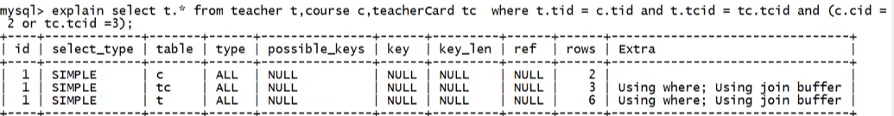
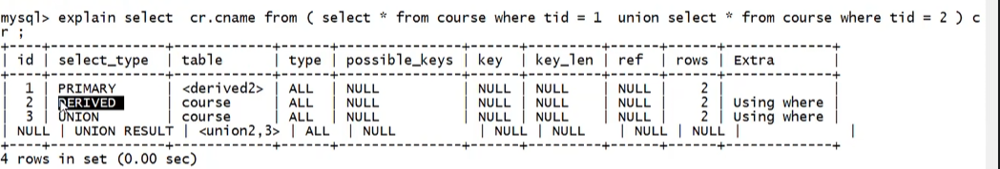
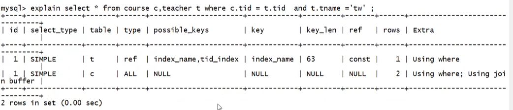
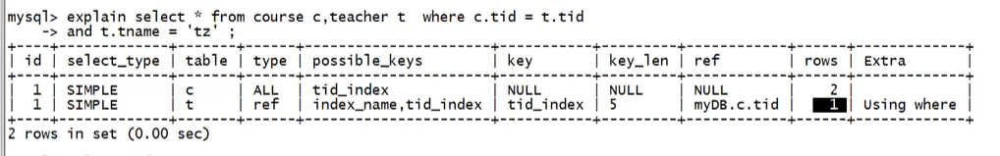

---

title: "SQL优化与锁机制"
description: 
date: 2024-12-23T18:04:06+08:00
image: 
math: 
license: 
hidden: false
comments: true
draft: false
tags:   
     - mysql
categories:
      - mysql
---

# SQL优化与锁机制

## SQL优化

通过SQL语句前加入explain进行分析

```
explain + 正常sql语句
```

explain内容分析：



### explain结构分析

**id**

- id值越大，先执行

- id值相同，从上往下执行

- 影响行数根据影响行数从小到大

**select_type**



- PRIMARY:包含子查询SQL中的主查询（最外层）

- SUBQUERY:包含子查询SQL中的子查询（非最外层）

- SIMPLE:简单查询（不包含子查询，union）

- DERIVED:衍生查询（使用到了临时表）

  - 在from子查询中只有一张表

    ```sql
    explain select cr.cname from(select * from course where tid in (1,2))
    ```

  - 在from子查询中，如果有table union table2，则table1就是derived

**type**

索引类型

```
system>const>eq_ref>ref>range>index>all
其中：system，const只是理想情况，实际上能达到ref>range
```

- system:只有一条数据的系统表或衍生表，只有一条数据的主查询
- const：仅仅能查到一条数据的SQL，用于Primary key 或 unique索引

- eq_ref：唯一索引，结果多条数据，但每条数据是唯一的

- ref：非唯一索引，对于每个索引键的查询，返回匹配的所有行（0，多）
- range:检索指定范围的行，where后面是一个范围查询（between，> < >=, in特殊）
- index：查询全部索引中的数据
- all：查询全部表中的数据

**possible_keys**

可能用到的索引，是一种预测，不准

如果是NULL则无索引

**key**

实际用到的索引

如果是NULL则无索引

**key_lens**

索引的长度

作用：用于判断复合索引是否被完全使用

ut8默认一个字符3个字节

如果可以为空则+1，如果是varchar再+2

**ref**

注意：与tepe中ref区分

作用：指明当前表所参照的字段(b.x)

```
explain select ... where a.c = b.x;
其中(b.x)可以是常量，const
```



**rows**

被索引优化查询的数据个数(实际通过索引查询到的数据个数)

```
select * from course c.teacher t where c.tid = t.tid
```



**Extra**

- using filesort:性能消耗比较大；需要“额外”一次排序（查询）常见于order by语句

```
explain select * from test02 where a1 = '' order by a2;  --using filesort
小结：对于单索引，如果排序和查找是同一个字段，则不会出现using filesort
避免：where哪些字段，就order by哪些字段 	 
```

```
alter table test02 add index idx_a1_a2_a3 (a1,a2,a3);
explain select * from test02 where a1 = '' order by a3;  --using filesort
小结：对于复合索引不能跨列（最佳左前缀）
避免：按照复合索引的顺序使用，不要跨列或无序使用（where和order by拼起来）
```

- using temporary:性能损耗大，用到了临时表，一般出现在group by语句中

- using index:性能提升；索引覆盖。

​	原因：不读取原文件，只从索引文件中查询数据（不需要回表查询）

​	using index时，会对possible_keys和key造成影响：

​		1.如果没有where，则索引只出现在key中

​		2.如果有where，则索引出现在key和possible_key中

- using where(需要回表查询)
- impossible where

​	where子句永远为false

### 优化实例

**第一个简单例子**

```
create table test03(
	a1 int(4) not null,
	a2 int(4) not null,
	a3 int(4) not null,
	a4 int(4) not null,
);
alter table test03 add index idx_a1_a2_a3_a4(a1,a2,a3,a4)

```

```
explain select a1,a2,a3,a4 from test03 where a1=1 and a2=2 and a3=3 and a4=4;		--推荐写法 using index
explain select a1,a2,a3,a4 from test03 where a4=1 and a3=2 and a2=3 and a1=4;		--虽然编写顺序和索引顺序不一致，但是sql在真正执行前经过了sql优化器的调整，结果与上述是一致的
explain select a1,a2,a3,a4 from test03 where a1=1 and a2=2 and a4=4 order by a3;	--以上sql用到了俩个索引a1,a2,该俩个字段不需要回表查询using index,a4需要回表查询
```

总结：

- 如果（abcd）复合索引和使用的顺序全部一致（且不跨列使用），则复合索引全部使用，如果部分一致，则使用部分索引

- where和order by拼起来，不要跨列使用

**单表优化**

1. 加索引 根据SQL解析顺便，来调整索引顺序，先解析where后解析select 索引一旦进行升级优化，需要将之前废弃索引删掉
1. 最佳左前缀，保持索引的定义和使用的顺序一致性
1. 将包含in的查询放到最后

**多表优化**

- 当编写 `on t.cid=c.tid` 时，将数据量小的表放左边（假设t表小）
- 索引往哪个表加？--小表驱动大表  --索引建立在经常使用的字段上
- 一般情况，对于左外连接给左表加索引，对于右外连接给右表加索引

**避免索引失效的一些原则**

- 复合索引，不要跨列或无序使用（最佳左前缀）
- 复合索引，尽量使用全索引匹配
- 不要在索引上进行任何操作（计算，函数，类型转换），否则索引失效，对于复合索引，如果左边失效，则右边全部失效
- 复合索引不能使用不等于或`is null`,否则自身及右侧全部失效
- 复合索引中如果有范围查询（>,<,in），则右侧索引全部失效（概率情况）
- 尽量使用索引覆盖（using index）,不会出现概率情况
- like尽量以常量开头，不要以%开头，否则索引失效（using index情况下不会失效）
- 尽量不要使用类型转换（显示，隐式），否则都会使索引失效
- 尽量不要使用or，否则索引失效

**一些其它优化方法**

- exist和in
  - 如果主查询的数据集大，则使用In
  - 如果子查询的数据集大，则使用exist
- order by 优化
  - 单路排序：只读取一次（全部字段），在buffer中进行排序。但此种单路排序会有一定隐患，不一定真的是单路，可能会多次IO
  - 提高order by查询策略：
    - 选择使用单路，双路，调整buffer容量大小
    - 避免select *
    - 复合索引，不要跨列使用，避免using filesort
    - 保证全部的排序字段排序一致性（都是升序或排序）

**SQL排查--慢查询日志**

MySQL提供的一种日志记录，用于记录MySQL中相应时间超过阈值的SQL语句（long_query_time,默认10秒）

慢查询日志默认是关闭的；建议开发调优时打开，而最终部署时关闭

检查是否开启了慢查询日志: `show variables like '%slow_query_log';`

开启慢查询日志：

```
临时开启：
set global slow_query_log = 1;	在内存中开启
exit
service mysql restart

永久开启：
/etc/my.cnf 中追加配置
[mysqld]
slow_query_log=1
slow_query_log_file=/var/lib/mysql/localhost-slow.log

慢查询阈值：
show variables like '%long_query_time%';
临时设置阈值：
set global long_query_time = 5;		--设置完毕后不会立刻生效，需要重新登陆后才能生效
永久设置阈值：
/etc/my.cnf 中追加配置
[mysqld]
long_query_time=3
```


```
查询超过阈值的SQL：
show global status like '%slow_queries';
```

慢查询的SQL被记录在日志中，因此可以通过日志来查看具体的慢SQL
查看上述的日志文件即可

通过mysqldumpslow工具查看慢SQL,可以通过一些过滤条件 快速查找需要定位的慢SQL

```
mysqldumpslow --help
s: 排序方式
r: 逆序
l: 锁定时间
g: 正则匹配模式
```

获取返回记录最多的三个SQL

```
mysqldumpslow -s r -t 3 /var/lib/mysql/localhost-slow.log
```

获取访问次数最多的3个SQL

```
mysqldumpslow -s c -t 3 /var/lib/mysql/localhost-slow.log
```

按照时间排序，前10条包含`left join`查询语句的SQL

```
mysqldumpslow -s t -t 10 -g "left join" /var/lib/mysql/localhost-slow.log
```

### profiles分析海量数据

`show profiles` --默认关闭

`show variables like '%profiling%';`

`set profiling = on;`

`show profiles;`会记录所有 `profiling`打开之后的 全部查询语句所花费的时间。缺点：不够精确

--- 精确分析：sql诊断

`show profile all for query Query_Id`上一步查询到的Query_Id

`show profile cpu blockio for query Query_Id`

​	
