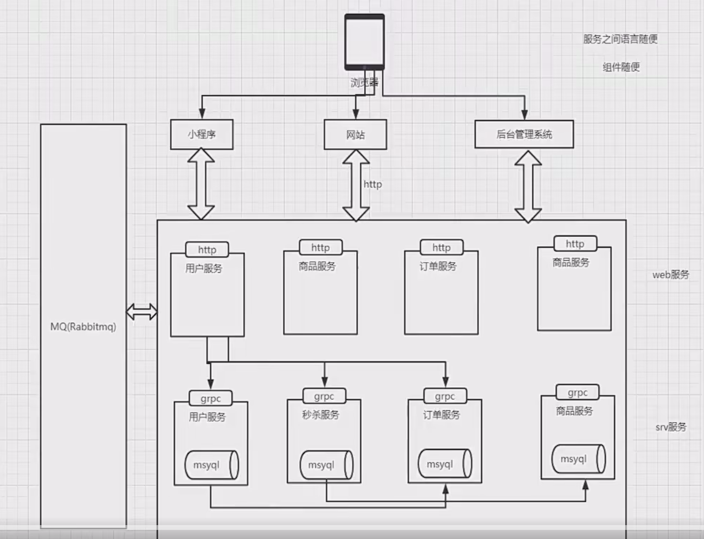

### 从0开始理解rpc

#### rpc核心概念理解

**什么是RPC**

​	RPC远程过程调用，简单理解是一个节点请求另一个节点提供的服务

​	对应rpc的是本地过程调用，函数调用是最常见的本地过程调用

**函数调用过程**

1. 将数据压入函数的栈中
2. 函数，从栈中取出数据并赋值
3. 执行函数操作，并将结果赋值给局部变量并压入栈中
4. 回到主函数，将栈中的值取出来赋值给全局变量

**远程过程面临问题**

1. Call的id映射
2. 序列化和反序列化
3. 网络传输

**rpc开发的四大要素**

1. 客户端
2. 客户端存根
3. 服务端
4. 服务端存根


```go
package main

import "fmt"

/*
我们原本的电商系统，有一个逻辑，这个逻辑是扣减库存
但是库存服务是一个独立的系统，reduce，那如何调用一定会牵扯到网络，做成一个web服务

1. 	这个函数的调用参数是如何传递的--JSON
	现在网络调用有俩个端 - 客户端、应该干嘛？将数据传输到GIN
	gin-服务端，服务端负责解析数据


*/

type Company struct {
	Name    string
	Address string
}

type Employee struct {
	Name    string
	Company *Company
}
type PrintResult struct {
	Info string
	Err  error
}

func Add(a, b int) int {
	return a + b
}

func RpcPrintln(employee Employee) {
	// rpc中的第二个点 传输协议，数据编码协议
	// http1.x http2.0协议
	// http协议底层tcp http现在主流是1.x 这种协议有性能问题 一次性 一旦结果返回连接就断开
	// 直接基于tcp/udp 协议去封装一层协议MyHttp，没有通用性， 更好的选择http2.0 既有http的特性，也有长连接的特性
	/*
		客户端
			1. 建立连接 tcp/http连接
			2. 将employee对象序列化成json字符串--序列化
			3. 发送json字符串 - 调用成功后实际上你接受到的是一个二进制数据
			4. 等待服务器发送结果
			5. 将服务器返回的数据解析成PrintResult对象 - 反序列化
		服务端
			1. 监听网络端口
			2. 读取数据 - 二进制json数据
			3. 对数据进行反序列化Employee对象
			4. 开始处理业务逻辑
			5. 将处理结果PrintResult序列化成json二进制数据 - 序列化
			6. 将数据返回

	*/
}

func main() {

	//fmt.Println(Add(1, 2))

	// 将这个打印的工作放在另一台服务器上
	// 没办法直接将本地的内存对象struct传入
	// 可行的方式是将struct序列化成json二进制对象
	fmt.Println(Employee{
		Name: "yuxiay",
		Company: &Company{
			Name:    "天理",
			Address: "天津",
		},
	})
	// 远程的服务器需要将二进制对象反解成struct对象
}

```


简单的客户端

```go
package main

import (
	"encoding/json"
	"fmt"

	"github.com/kirinlabs/HttpRequest"
)

// rpc远程过程调用，如何做到像本地调用

type ResponseData struct {
	Data int `json:"data"`
}

func Add(a, b int) int {
	// 传输协议: http
	req := HttpRequest.NewRequest()
	res, _ := req.Get(fmt.Sprintf("http://127.0.0.1:8080/%s?a=%d&b=%d", "add", a, b))
	body, _ := res.Body()
	//fmt.Println(string(body))
	rspData := ResponseData{}
	_ = json.Unmarshal(body, &rspData)
	return rspData.Data
}

func main() {
	fmt.Println(Add(1, 2))
}

```


简单的服务端

```go
package main

import (
	"encoding/json"
	"fmt"
	"net/http"
	"strconv"
)

func main() {
	// http://127.0.0.1:8000/add?a=1&b=2
	// 返回的格式化： json{“data”：3}
	// 1. callID的问题： r.URL.Path  2. 数据传输协议 url的参数传递协议 3. 网络传输协议 http
	http.HandleFunc("/add", func(w http.ResponseWriter, r *http.Request) {
		_ = r.ParseForm() // 解析参数
		fmt.Println("path", r.URL.Path)
		a, _ := strconv.Atoi(r.Form["a"][0])
		b, _ := strconv.Atoi(r.Form["b"][0])
		w.Header().Set("Content-Type", "application/json")
		jData, _ := json.Marshal(map[string]int{
			"data": a + b,
		})
		_, _ = w.Write(jData)
	})
	_ = http.ListenAndServe(":8080", nil)
}

```


#### go内置rpc快速开发

#### 什么是grpc和protobuf

gRPC 是一个高性能、开源和通用的 RPC 框架，面向移动和 HTTP/2 设计。目前提供 C、Java 和 Go 语言版本，分
别是：grpc, grpc-java, grpc-go. 其中 C 版本支持 C, C++, Node.js, Python, Ruby, Objective-C, PHP 和 C# 支持.
grpc 项目地址优质IT资源微信x923713

protobuf
java 中的 dubbo dubbo/rmi/hessian messagepack 如果你懂了协议完全有能力自己去实现一个协议
习惯用 Json、XML 数据存储格式的你们，相信大多都没听过 Protocol Buffer
Protocol Buffer 其实 是 Google 出品的一种轻量 & 高效的结构化数据存储格式，性能比 Json、XML 真
的强！太！多！
protobuf 经历了 protobuf2 和 protobuf3，pb3 比 pb2 简化了很多，目前主流的版本是 pb3优质IT资源微信x923713

#### go语言grpc快速体验

proto(简单模式)

```protobuf
syntax = "proto3";
option go_package = ".; proto";

service Greeter{
  rpc SayHello(HelloRequest) returns (HelloReply);
}

message HelloRequest{
  string name = 1;
}

message HelloReply{
  string message = 1;
}

// go语言生成俩个文件a
```


通过这个生成文件

```protobuf
protoc -I . user.proto --go_out=. --go-grpc_out=.

```


server服务端

```go
package main

import (
	"context"
	"go_study_demo/ch2/grpc_test/proto"
	"net"

	"google.golang.org/grpc"
)

type Server struct {
	proto.UnimplementedGreeterServer // 添加这行
}

func (s *Server) SayHello(ctx context.Context, request *proto.HelloRequest) (*proto.HelloReply, error) {
	return &proto.HelloReply{
		Message: "hello" + request.Name,
	}, nil
}

func main() {
	// 1.实例化一个server
	g := grpc.NewServer()
	// 2.注册处理逻辑handler
	proto.RegisterGreeterServer(g, &Server{})
	lis, err := net.Listen("tcp", ":8888")
	if err != nil {
		panic("failed to listen" + err.Error())
	}
	// 3.启动服务
	_ = g.Serve(lis)
}

```


client客户端

```go
package main

import (
	"context"
	"fmt"
	"go_study_demo/ch2/grpc_test/proto"

	"google.golang.org/grpc/credentials/insecure"

	"google.golang.org/grpc"
)

func main() {
	conn, err := grpc.NewClient("127.0.0.1:8888", grpc.WithTransportCredentials(insecure.NewCredentials()))
	if err != nil {
		panic("failed")
	}
	defer conn.Close()
	c := proto.NewGreeterClient(conn)
	r, err := c.SayHello(context.Background(), &proto.HelloRequest{
		Name: "grpc",
	})
	if err != nil {
		panic(err)
	}
	fmt.Println(r.Message)
}

```


#### grpc流模式调用

**grpc四种数据流**

1. 简单模式

   ​	即客户端发起一次请求，服务端响应一个数据

2. 服务端数据流模式

   ​	客户端发起一次请求，服务端返回一段连续的数据流

3. 客户端数据流模式

   ​	客户端源源不断的向服务端发送数据流，而在发送结束后，由服务端返回一个响应

4. 双向流模式

   ​	客户端和服务端都可以向对方发送数据流，这个时候双方的数据可以同时互相发送，可以实现实时交互，典型例子是聊天


**proto**

```proto
syntax = "proto3";

option go_package = ".;proto";

service Greeter{
  rpc GetStream(StreamReqData) returns (stream StreamResData);  // 服务端流模式
  rpc PutStream(stream StreamReqData) returns (StreamResData);  // 客户端流模式
  rpc AllStream(stream StreamReqData) returns (stream StreamResData);  // 双向流模式

}

message StreamReqData{
  string data = 1;
}

message StreamResData{
  string data = 1;
}
```


**服务端**

```go
package main

import (
	"fmt"
	"go_study_demo/ch2/stream_grpc_test/proto"
	"net"
	"sync"
	"time"

	"google.golang.org/grpc"
)

// 服务端流模式不能直接使用return返回，无法实现源源不断返回
// 所以使用res.send方法

const PORT = ":50052"

type server struct {
	proto.UnimplementedGreeterServer
}

// GetStream 服务流模式
func (s *server) GetStream(req *proto.StreamReqData, res proto.Greeter_GetStreamServer) error {
	i := 0
	for {
		i++
		_ = res.Send(&proto.StreamResData{
			Data: fmt.Sprintf("%v", time.Now().Unix()),
		})
		time.Sleep(time.Second)
		if i > 10 {
			break
		}
	}
	return nil
}

// PutStream 客户端流模式
func (s *server) PutStream(res proto.Greeter_PutStreamServer) error {
	for {
		if a, err := res.Recv(); err != nil {
			fmt.Println(err)
			break
		} else {
			fmt.Println(a)
		}
	}
	return nil
}

// ALLStream 双向流模式
func (s *server) AllStream(allStr proto.Greeter_AllStreamServer) error {
	// 需要使用协程来双向，进行并行
	wg := sync.WaitGroup{}
	wg.Add(2)
	go func() {
		defer wg.Done()
		for {
			data, _ := allStr.Recv()
			fmt.Println(data)
		}
	}()

	go func() {
		defer wg.Done()
		for {
			_ = allStr.Send(&proto.StreamResData{
				Data: "我是服务器",
			})
			time.Sleep(time.Second)
		}
	}()
	wg.Wait()
	return nil
}

func main() {
	// 监听端口
	lis, err := net.Listen("tcp", PORT)
	if err != nil {
		panic(err)
	}
	// 创建一个新的gRPC服务器实例
	s := grpc.NewServer()

	// 注册Greeter服务到gRPC服务器
	proto.RegisterGreeterServer(s, &server{})

	// 开始通过提供的监听器lis接受传入连接，并用s来处理请求
	err = s.Serve(lis)
	if err != nil {
		panic(err)
	}

}

```


**客户端**

```go
package main

import (
	"context"
	"fmt"
	"go_study_demo/ch2/stream_grpc_test/proto"
	"sync"
	"time"

	"google.golang.org/grpc"
	"google.golang.org/grpc/credentials/insecure"
)

func main() {
	conn, err := grpc.NewClient("127.0.0.1:50052", grpc.WithTransportCredentials(insecure.NewCredentials()))
	if err != nil {
		panic(err)
	}
	defer conn.Close()

	// 创建一个Greeter服务的客户端
	c := proto.NewGreeterClient(conn)

	// 服务端流模式
	// 发送StreamReqData请求并接收响应流
	res, _ := c.GetStream(context.Background(), &proto.StreamReqData{Data: "天津"})

	// 进入循环，不断从流中接收消息直到遇到错误或完成
	for {
		a, err := res.Recv() // 接受send的信息
		if err != nil {
			fmt.Println(err)
			break
		}
		fmt.Println(a.Data)
	}

	// 客户端流模式
	putS, _ := c.PutStream(context.Background())
	i := 0
	for {
		i++
		putS.Send(&proto.StreamReqData{
			Data: fmt.Sprintf("天津%d", i),
		})
		time.Sleep(time.Second)
		if i > 10 {
			break
		}
	}

	// 双向流模式
	allStr, _ := c.AllStream(context.Background())
	wg := sync.WaitGroup{}
	wg.Add(2)
	go func() {
		defer wg.Done()
		for {
			data, _ := allStr.Recv()
			fmt.Println(data)
		}
	}()

	go func() {
		defer wg.Done()
		for {
			_ = allStr.Send(&proto.StreamReqData{
				Data: "我是客户端",
			})
			time.Sleep(time.Second)
		}
	}()
	wg.Wait()

}

```


### grpc和protobuf进阶

#### grpc拦截器-go

功能：记录接口访问时长，验证登陆情况，等等，拦截请求，进行预处理

```go
s := grpc.NewServer(
		grpc.UnaryInterceptor(grpc_middleware.ChainUnaryServer(
			//otelgrpc.UnaryServerInterceptor(),
			interceptor.New().CacheInterceptor(),
		)),
	)
```


### 分层微服务架构




彼此直接互不影响，版本什么各类问题互不影响

可以同层之间调用，也可以上调用下，不可以下调上


