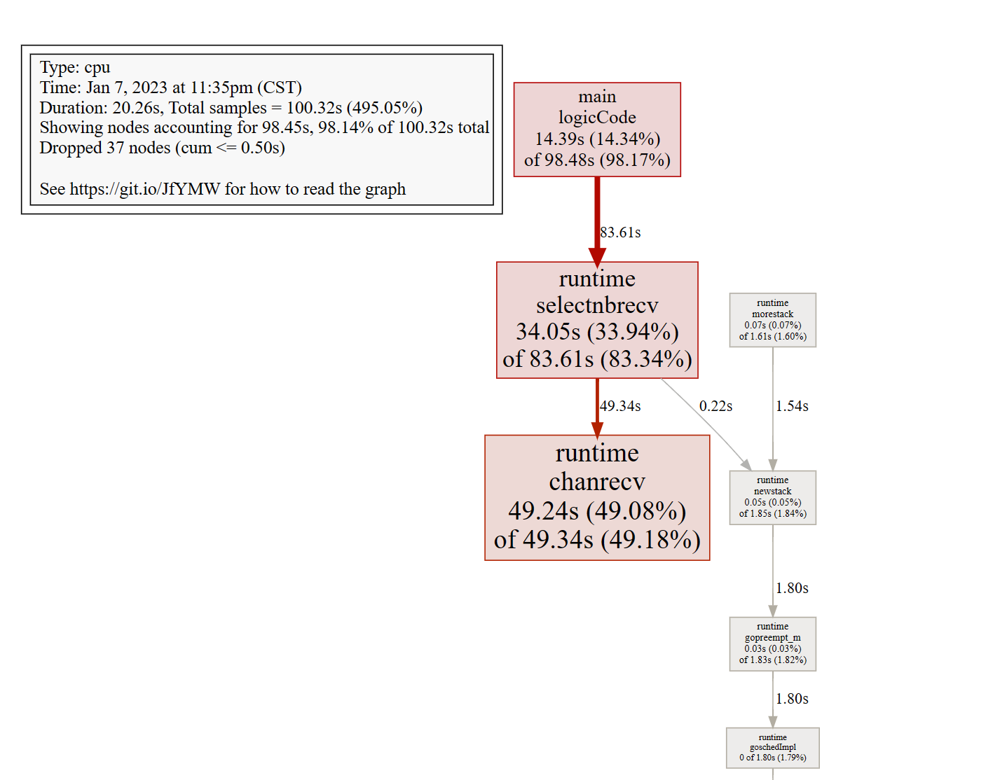
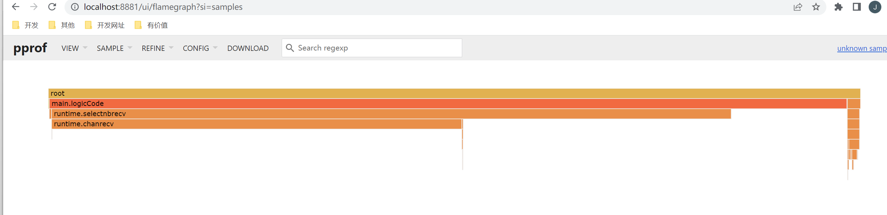

## pprof

Go语言内置了获取程序的运行数据的工具，包括以下两个标准库：

- `runtime/pprof`：采集工具型应用运行数据进行分析
- `net/http/pprof`：采集服务型应用运行时数据进行分析

net/http/pprof源码上也是根据runtime/pprof进行编写

pprof开启后，每隔一段时间（10ms）就会收集下当前的堆栈信息，获取各个函数占用的CPU以及内存资源；最后通过对这些采样数据进行分析，形成一个性能分析报告。

注意，我们只应该在性能测试的时候才在代码中引入pprof

### 作用

`pprof` 是 Go 语言中分析程序运行性能的工具，它能提供各种性能数据：

| 类型         | 描述                       |
| ------------ | -------------------------- |
| allocs       | 内存分配情况的采样信息     |
| blocks       | 阻塞操作情况的采样信息     |
| threadcreate | 系统线程创建情况的采样信息 |
| goroutine    | 当前所有协程的堆栈信息     |
| heap         | 堆上内存使用情况的采用信息 |
| mutex        | 锁争用情况的采样信息       |
| cmdline      | 显示程序启动命令以及参数   |
| profile      | CPU占用情况采样信息        |
| trace        | 程序运行跟踪信息           |

### 工具型

runtime/pprof包中预制了一些profile：

* cpu：cpu使用情况
* memory（heap）：内存使用情况
* threadcreate: os线程使用情况
* goroutine：所有当前运行的goroutine堆栈跟踪信息
* block：goroutine阻塞等待的情况
* mutex：锁竞争的情况（一般是由于锁竞争导致cpu未被充分利用）

开启CPU性能分析：

```go
pprof.StartCPUProfile(w io.Writer)
```

停止CPU性能分析：

```go
pprof.StopCPUProfile()
```

应用执行结束后，就会生成一个文件，保存了我们的 CPU profiling 数据。得到采样数据之后，使用`go tool pprof`工具进行CPU性能分析。

记录程序的堆栈信息

```go
pprof.WriteHeapProfile(w io.Writer)
```

得到采样数据之后，使用`go tool pprof`工具进行内存性能分析。

`go tool pprof`默认是使用`-inuse_space`进行统计，还可以使用`-inuse-objects`查看分配对象的数量。

#### 案例

```go
package main

import (
    "flag"
    "fmt"
    "os"
    "runtime/pprof"
    "time"
)

// 一段有问题的代码
func logicCode() {
    var c chan int
    for {
        select {
        case v := <-c:
            fmt.Printf("recv from chan, value:%v\n", v)
        default:

        }
    }
}

func main() {
    // 两个标志位: 是否开启CPU和内存的标志位
    var isCPUPprof bool
    var isMemPprof bool

    // 命令行参数定义
    flag.BoolVar(&isCPUPprof, "cpu", false, "turn cpu pprof on")
    flag.BoolVar(&isMemPprof, "mem", false, "turn mem pprof on")
    flag.Parse()

    // 是否开启CPUprofile
    if isCPUPprof {
        // 在当前路径建立一个文件
        file, err := os.Create("./cpu.pprof")
        if err != nil {
            fmt.Printf("create cpu pprof failed, err:%v\n", err)
            return
        }
        // 往文件中记录CPU proofile信息
        pprof.StartCPUProfile(file)
        defer func() {
            pprof.StopCPUProfile()
            file.Close()
        }()
    }

    for i := 0; i < 8; i++ {
        go logicCode()
    }

    // 程序跑20s
    time.Sleep(20 * time.Second)

    // 是否开启内存profile
    if isMemPprof {
        file, err := os.Create("./mem.pprof")
        if err != nil {
            fmt.Printf("create mem pprof failed, err:%v\n", err)
            return
        }
        pprof.WriteHeapProfile(file)
        file.Close()
    }

}
```

```
 go run .\main.go -cpu
```

等待20s，生成cpu.pprof

~~~shell
go tool pprof cpu.pprof
Type: cpu
Time: Jan 7, 2023 at 12:51am (CST)
Duration: 20.30s, Total samples = 100.47s (494.88%)
Entering interactive mode (type "help" for commands, "o" for options)
(pprof)

~~~

* Duration：程序执行时间。
* Total samples：采样时间，比如采样时间100s，有10核，每核采样10s

输入`top 5`来显示占用CPU前5的函数：

~~~shell
(pprof) top 5
Showing nodes accounting for 98.19s, 97.73% of 100.47s total
Dropped 44 nodes (cum <= 0.50s)
Showing top 5 nodes out of 9
      flat  flat%   sum%        cum   cum%
    49.38s 49.15% 49.15%     49.54s 49.31%  runtime.chanrecv
    33.20s 33.04% 82.19%     83.07s 82.68%  runtime.selectnbrecv
    14.76s 14.69% 96.88%     98.16s 97.70%  main.logicCode
     0.46s  0.46% 97.34%      0.76s  0.76%  runtime.findrunnable
     0.39s  0.39% 97.73%      2.19s  2.18%  runtime.schedule

~~~

- flat：当前函数占用CPU的耗时
- flat%：:当前函数占用CPU的耗时百分比
- sun%：函数占用CPU的耗时累计百分比
- cum：当前函数加上调用当前函数的函数占用CPU的总耗时
- cum%：当前函数加上调用当前函数的函数占用CPU的总耗时百分比
- 最后一列：函数名称


> 可以看出，main.logicCode占用的cpu最多

输入`list logicCode`来查看具体的信息：

~~~shell
(pprof) list logicCode
Total: 100.47s
ROUTINE ======================== main.logicCode in D:\go\project\test_project\ip-get\pprof_test\main.go
    14.76s     98.16s (flat, cum) 97.70% of Total
         .          .      7:   "runtime/pprof"
         .          .      8:   "time"
         .          .      9:)
         .          .     10:
         .          .     11:// 一段有问题的代码
         .      120ms     12:func logicCode() {
         .          .     13:   var c chan int
         .          .     14:   for {
         .          .     15:           select {
    14.76s     98.04s     16:           case v := <-c:
         .          .     17:                   fmt.Printf("recv from chan, value:%v\n", v)
         .          .     18:           default:
         .          .     19:
         .          .     20:           }
         .          .     21:   }
(pprof)

~~~

> 很明显得出：case v := <-c:这行代码有问题，当然代码的问题也很明显，因为default无内容，channel中又没有任何信息，会一直卡在这处代码，所以解决方案，default加一些信息即可

~~~go
func logicCode() {
	var c chan int
	for {
		select {
		case v := <-c:
			fmt.Printf("recv from chan, value:%v\n", v)
		default:
			time.Sleep(time.Second * 2)
		}
	}
}

~~~

重新生成，发现问题消失

#### 1.3.3 命令说明

* web：浏览器会弹出各个函数之间的调用图，以及内存的之间的关系
* top：按指标大小列出前n个函数，比如内存是按内存占用多少，CPU是按执行时间多少。
* list：查看某个函数的代码，以及该函数每行代码的指标信息，如果函数名不明确，会进行模糊匹配，比如`list main`会列出`main.main`和`runtime.main`
* traces：打印所有调用栈，以及调用栈的指标信息。使用方式为`traces+函数名`（模糊匹配）。

#### 1.3.4 图形化

地址：https://graphviz.gitlab.io/ 

安装完后，在pprof命令中输入`svg`或者`gif`



图中各个方块的大小也代表 CPU 占用的情况，方块越大说明占用 CPU 时间越长。

线条代表了函数的调用链，线条越粗，代表指向的函数消耗了越多的资源。反之亦然。

线条的样式代表了调用关系。实线代表直接调用；虚线代表中间少了几个节点；带有inline字段表示该函数被内联进了调用方。

> 除了这种方式，目前推荐的是pprof，也就是说pprof就已经集成了这样的功能，包括火焰图等，
>
> 地址：https://github.com/google/pprof

~~~shell
go tool pprof -http=":8881" .\cpu.pprof

~~~



火焰图就看长短即可。每一个方块代表的是函数，长短就是执行时间，调用关系是从上到下。颜色无特殊含义。

#### 比较

~~~shell
go tool pprof -base .\mem1.pprof .\mem.pprof 
~~~

假设我们已经通过命令行得到profile1与profile2,使用go tool pprof -base profile1 profile2，便可以以profile1为基础，得出profile2在profile1之上出现了哪些变化。通过两个时间切片的比较，我们可以清晰的了解到，两个时间节点之中发生的变化，方便我们定位问题


#### 总结步骤

* 通过监控平台监测到内存或cpu问题。
* 通过浏览器方式大致判断是哪些可能的问题。
* 通过命令行方式抓取几个时间点的profile
* 使用web命令查看函数调用图
* 使用top 、traces、list 命令定位问题
* 如果出现了goroutine泄漏或者内存泄漏等随着时间持续增长的问题，go tool pprof -base比较两个不同时间点的状态更方便我们定位问题。

### 服务型

在Web服务中，我们使用服务型进行性能分析

注：也是基于工具型来实现的

如果使用的gin框架，则可以直接使用[github.com/gin-contrib/pprof](https://github.com/gin-contrib/pprof)，在代码中通过以下命令注册pprof相关路由。

```go
pprof.Register(router)
```

以gin框架为例，使用方式和上面一样，无非profile文件变成了一个http连接

~~~shell
go tool pprof http://localhost/debug/pprof/heap
~~~

#### 案例

模拟内存泄漏，一般内存泄漏大多是goroutine泄漏

~~~go
func main() {
	r := gin.Default()
	r.Use(midd.RequestLog())
	//路由
	router.InitRouter(r)
	r.StaticFS("/upload", http.Dir("upload"))
	//开启pprof
	pprof.Register(r)
	r.GET("/mem", func(c *gin.Context) {
		// 业务代码运行
		outCh := make(chan int)
		// 每秒起10个goroutine，goroutine会阻塞，不释放内存
		tick := time.Tick(time.Second / 10)
		i := 0
		for range tick {
			i++
			fmt.Println(i)
			alloc1(outCh) // 不停的有goruntine因为outCh堵塞，无法释放
		}
	})
	srv.Run(r, config.C.SC.Name, config.C.SC.Addr, nil)
}

// 一个外层函数
func alloc1(outCh chan<- int) {
	go alloc2(outCh)
}

// 一个内层函数
func alloc2(outCh chan<- int) {
	func() {
		defer fmt.Println("alloc-fm exit")
		// 分配内存，假用一下
		buf := make([]byte, 1024*1024*10)
		_ = len(buf)
		fmt.Println("alloc done")

		outCh <- 0
	}()
}

~~~

~~~shell
go tool pprof http://localhost/debug/pprof/goroutine
Type: goroutine
Time: Jan 8, 2023 at 11:22am (CST)
Entering interactive mode (type "help" for commands, "o" for options)
(pprof) top
Showing nodes accounting for 751, 99.73% of 753 total
Dropped 64 nodes (cum <= 3)
Showing top 10 nodes out of 19
      flat  flat%   sum%        cum   cum%
       751 99.73% 99.73%        751 99.73%  runtime.gopark
         0     0% 99.73%          4  0.53%  io.ReadFull
         0     0% 99.73%        723 96.02%  main.alloc2
         0     0% 99.73%        723 96.02%  main.alloc2.func1

~~~

可以看到有751个goroutine处于挂起（runtime.gopark）状态，即goroutine泄漏。

~~~shell
(pprof) traces 
Type: goroutine
Time: Jan 8, 2023 at 11:22am (CST)
-----------+-------------------------------------------------------
       723   runtime.gopark
             runtime.chansend
             runtime.chansend1
             main.alloc2.func1
             main.alloc2

~~~

trace命令,可以查看栈调用信息，就能很快的找到问题在于main包中alloc2方法的匿名函数出现了channel send堵塞。

~~~shell
(pprof) list main.alloc2
Total: 753
ROUTINE ======================== main.alloc2 in D:\go\project\test_project\project-api\main.go
         0        723 (flat, cum) 96.02% of Total
         .          .     49:           buf := make([]byte, 1024*1024*10)
         .          .     50:           _ = len(buf)
         .          .     51:           fmt.Println("alloc done")
         .          .     52:
         .          .     53:           outCh <- 0
         .        723     54:   }()
         .          .     55:}
ROUTINE ======================== main.alloc2.func1 in D:\go\project\test_project\project-api\main.go
         0        723 (flat, cum) 96.02% of Total
         .          .     48:           // 分配内存，假用一下
         .          .     49:           buf := make([]byte, 1024*1024*10)
         .          .     50:           _ = len(buf)
         .          .     51:           fmt.Println("alloc done")
         .          .     52:
         .        723     53:           outCh <- 0
         .          .     54:   }()
         .          .     55:}

~~~

最终定位是`outCh <- 0`发生了问题，当然原因是channel只发，未取 造成了阻塞
