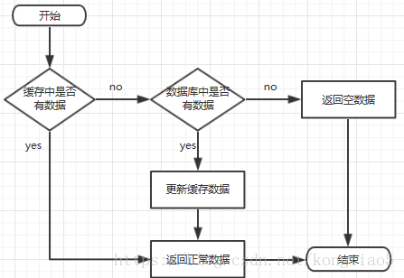
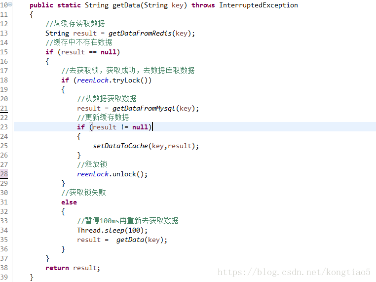

### Redis

设计[一个缓存系统](http://mp.weixin.qq.com/s?__biz=MzU5NTAzNjM0Mw==&mid=2247485849&idx=2&sn=a85a71485fc64bf34e5f1e4971dc2469&chksm=fe795841c90ed157f347ef6b0bccdb7aa5e49cade80eb9a5be96329cd8f813d06e4b335cfdac&scene=21#wechat_redirect)，不得不要考虑的问题就是：缓存穿透、[缓存击穿](https://so.csdn.net/so/search?q=缓存击穿&spm=1001.2101.3001.7020)与失效时的雪崩效应。

前台请求，后台先从缓存中取数据，取到直接返回结果，取不到时从数据库中取，数据库取到更新缓存，并返回结果，数据库也没取到，那直接返回空结果。

#### **缓存穿透**

**描述：**

​    缓存穿透是指**缓存和数据库中都没有的数据**，而用户不断发起请求。由于缓存是不命中时被动写的，并且出于容错考虑，如果从存储层查不到数据则不写入缓存，这将导致这个不存在的数据每次请求都要到存储层去查询，失去了缓存的意义。

在流量大时，可能DB就挂掉了，要是有人利用不存在的key频繁攻击我们的应用，这就是漏洞。

如发起为id为“-1”的数据或id为特别大不存在的数据。这时的用户很可能是攻击者，攻击会导致数据库压力过大。

 **解决方案：**

| **接口层增加校验**，如用户鉴权校验，id做基础校验，id<=0的直接拦截； |
| ------------------------------------------------------------ |
| 从缓存取不到的数据，在数据库中也没有取到，这时也可以将key-value对写为**key-null**，**缓存有效时间可以设置短点**，如30秒（设置太长会导致正常情况也没法使用）。这样可以防止攻击用户反复用同一个id暴力攻击 |
|                                                              |

#### **缓存击穿**

**描述：**

   ***\*缓存击穿是指缓存中没有但数据库中有的数据（一般是缓存时间到期）\****，这时由于并发用户特别多，同时读缓存没读到数据，又同时去数据库去取数据，引起数据库压力瞬间增大，造成过大压力。

 **解决方案：**

**1、设置热点数据永远不过期。**

 

**2、接口限流与熔断，降级。**重要的接口一定要做好限流策略，防止用户恶意刷接口，同时要降级准备，当接口中的某些 服务 不可用时候，进行熔断，失败快速返回机制。

 

**3、布隆过滤器****。**bloomfilter就类似于一个hash set，用于快速判某个元素是否存在于集合中，其典型的应用场景就是快速判断一个key是否存在于某容器，不存在就直接返回。布隆过滤器的关键就在于hash算法和容器大小，

 

**4、加互斥锁**，互斥锁参考代码如下：

 说明：

​     1）缓存中有数据，直接走上述代码13行后就返回结果了

​     2）缓存中没有数据，第1个进入的线程，获取锁并从数据库去取数据，没释放锁之前，其他并行进入的线程会等待100ms，再重新去缓存取数据。这样就防止都去数据库重复取数据，重复往缓存中更新数据情况出现。

​     3）当然这是简化处理，理论上如果能根据key值加锁就更好了，就是线程A从数据库取key1的数据并不妨碍线程B取key2的数据，上面代码明显做不到这点。
 

#### **缓存雪崩**

 **描述：**

   [缓存雪崩](https://so.csdn.net/so/search?q=缓存雪崩&spm=1001.2101.3001.7020)是指缓存中数据大批量到过期时间，而查询数据量巨大，引起数据库压力过大甚至down机。和缓存击穿不同的是，    缓存击穿指并发查同一条数据，缓存雪崩是不同数据都过期了，很多数据都查不到从而查数据库。

**解决方案**：

1. 缓存数据的过期时间设置随机，防止同一时间大量数据过期现象发生。
2. 如果缓存数据库是分布式部署，将热点数据均匀分布在不同搞得缓存数据库中。
3. 设置热点数据永远不过期。