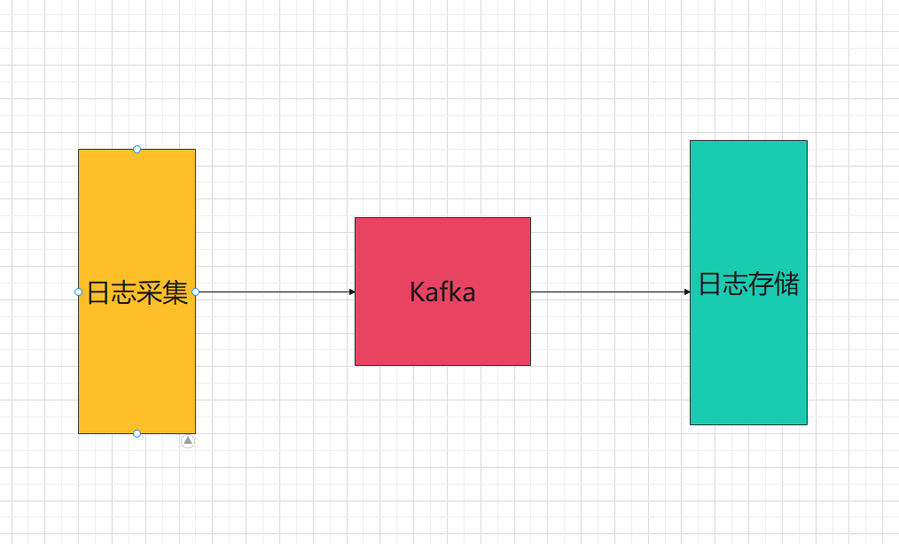
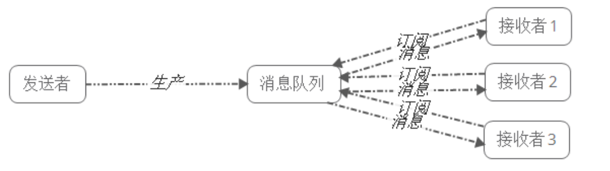

## 前言

我们虽然利用zap记录了日志，但是这里面有一些问题，我们假设应用部署在了20台机器上，如果需要查看日志时，我们需要登录到所有的机器上去查看日志，当机器数量在往上增的时候，这样的方式去查看日志，很明显就不合适了

解决上述问题，有效的思路很明显是讲日志统一收集起来，放在一个统一的地方进行查看。

当然日志量级非常大，考虑到性能问题，我们引入kafka来做日志采集。

日志采集有两种方案

* 直接将日志发送到kafka
* 监听之前记录的日志文件，有新增就写入kafka

日志存储方案比较多

* mysql数据库
* mongo数据库
* ELK（Elasticsearch , Logstash, Kibana）架构
* 分布式文件存储等

## 1. kafka

Kafka 是一个分布式的流式处理平台，它以高吞吐、可持久化、可水平扩展、支持流数据处理等多种特性而被广泛使用。

Kafka也是我们常说的消息队列中间件。

Kafka的性能非常高，并且非常稳定，即使在大数据量，比如TB级数据量时也能保证稳定的性能，同时Kafka的速度也非常快。

在不考虑数据零丢失的场景下，Kafka可达到百万级别的吞吐量，数据零丢失的场景下也能达到十万级，所以Kafka的使用非常广。

Kafka的社区活跃度高，开源多年，但Kafka最初就是奔着处理大数据的，所以Kafka是广泛应用在大数据领域，比如流式实时计算，日志采集等方面。

一些业务场景，可以选择诸如RabBitMQ,RocketMQ等

### 1.1 部署

最新的版本为3.3.2 ，在3.x的版本中，kafka已经可以不依赖zookeeper，而是使用自带的kraft机制。

~~~yaml
kafdrop:
    container_name: kafdrop
    image: obsidiandynamics/kafdrop
    restart: "no"
    ports:
      - "9000:9000"
    environment:
      KAFKA_BROKERCONNECT: "kafka:29092"
      JVM_OPTS: "-Xms16M -Xmx48M -Xss180K -XX:-TieredCompilation -XX:+UseStringDeduplication -noverify"
    depends_on:
      - "kafka"
  kafka:
    container_name: kafka
    image: obsidiandynamics/kafka
    restart: "no"
    ports:
      - "2181:2181"
      - "9092:9092"
    environment:
      KAFKA_LISTENERS: "INTERNAL://:29092,EXTERNAL://:9092"
      KAFKA_ADVERTISED_LISTENERS: "INTERNAL://kafka:29092,EXTERNAL://localhost:9092"
      KAFKA_LISTENER_SECURITY_PROTOCOL_MAP: "INTERNAL:PLAINTEXT,EXTERNAL:PLAINTEXT"
      KAFKA_INTER_BROKER_LISTENER_NAME: "INTERNAL"
      KAFKA_ZOOKEEPER_SESSION_TIMEOUT: "6000"
      KAFKA_RESTART_ATTEMPTS: "10"
      KAFKA_RESTART_DELAY: "5"
      ZOOKEEPER_AUTOPURGE_PURGE_INTERVAL: "0"
~~~

### 1.2 生产者

安装go kafka

~~~go
go get github.com/segmentio/kafka-go
~~~

~~~go
// to produce messages
topic := "my-topic"
partition := 0

conn, err := kafka.DialLeader(context.Background(), "tcp", "localhost:9092", topic, partition)
if err != nil {
    log.Fatal("failed to dial leader:", err)
}

conn.SetWriteDeadline(time.Now().Add(10*time.Second))
_, err = conn.WriteMessages(
    kafka.Message{Value: []byte("one!")},
    kafka.Message{Value: []byte("two!")},
    kafka.Message{Value: []byte("three!")},
)
if err != nil {
    log.Fatal("failed to write messages:", err)
}

if err := conn.Close(); err != nil {
    log.Fatal("failed to close writer:", err)
}
~~~

### 1.3 消费者

~~~go
// to consume messages
topic := "my-topic"
partition := 0

conn, err := kafka.DialLeader(context.Background(), "tcp", "localhost:9092", topic, partition)
if err != nil {
    log.Fatal("failed to dial leader:", err)
}

conn.SetReadDeadline(time.Now().Add(10*time.Second))
batch := conn.ReadBatch(10e3, 1e6) // fetch 10KB min, 1MB max

b := make([]byte, 10e3) // 10KB max per message
for {
    n, err := batch.Read(b)
    if err != nil {
        break
    }
    fmt.Println(string(b[:n]))
}

if err := batch.Close(); err != nil {
    log.Fatal("failed to close batch:", err)
}

if err := conn.Close(); err != nil {
    log.Fatal("failed to close connection:", err)
}
~~~

## 2. 日志发送

~~~go
package kk

import (
	"context"
	"errors"
	"github.com/segmentio/kafka-go"
	"go.uber.org/zap"
	"time"
)

type LogData struct {
	Data  string
	Topic string
}
type KafkaWriter struct {
	w    *kafka.Writer
	Data chan LogData
}

//GetWriter 初始化客户端
func GetWriter(addr string) *KafkaWriter {
	w := &kafka.Writer{
		Addr:     kafka.TCP(addr),
		Balancer: &kafka.LeastBytes{},
	}
	k := &KafkaWriter{w: w, Data: make(chan LogData)}
	go k.sendMsg()
	return k
}

func (kw *KafkaWriter) Send(msg LogData) {
	kw.Data <- msg
}

func (kw *KafkaWriter) sendMsg() {
	for {
		select {
		case data := <-kw.Data:
			msg := kafka.Message{
				Topic: data.Topic,
				Value: []byte(data.Data),
			}
			var err error
			const retries = 3
			for i := 0; i < retries; i++ {
				ctx, cancel := context.WithTimeout(context.Background(), 10*time.Second)
				defer cancel()
				err = kw.w.WriteMessages(ctx, msg)
				if err == nil {
					break
				}
				if errors.Is(err, kafka.LeaderNotAvailable) || errors.Is(err, context.DeadlineExceeded) {
					time.Sleep(time.Millisecond * 250)
					continue
				}
				if err != nil {
					zap.L().Error("kafka send log writer msg err", zap.Error(err))
				}
			}

		}
	}
}

~~~

## 3. 日志接收

~~~go
package kk

import (
	"context"
	"fmt"
	"github.com/segmentio/kafka-go"
	"go.uber.org/zap"
)

type KafkaReader struct {
	r *kafka.Reader
}

func (r *KafkaReader) readMsg() {
	for {
		m, err := r.r.ReadMessage(context.Background())
		if err != nil {
			zap.L().Error("kafka receiver read msg err", zap.Error(err))
			continue
		}
		fmt.Printf("message at offset %d: %s = %s\n", m.Offset, string(m.Key), string(m.Value))
	}
}

func GetReader(brokers []string, groupId, topic string) *KafkaReader {
	r := kafka.NewReader(kafka.ReaderConfig{
		Brokers:  brokers,
		GroupID:  groupId,
		Topic:    topic,
		MinBytes: 10e3,
		MaxBytes: 10e6,
	})
	k := &KafkaReader{
		r: r,
	}
	go k.readMsg()
	return k
}

~~~

## 4. ELK

- ElasticSearch：负责分布式存储日志数据，给Kibana提供可视化的数据源
- LogStash：负责消费Kafka消息队列中的原始数据，并将消费的数据上报到ElasticSearch进行存储
- Kibana：负责可视化ElasticSearch中存储的数据，并提供查询、聚合、图表、导出等功能

### 4.1 部署ES和Kibana

~~~yaml
es:
    container_name: es
    image: elasticsearch:8.6.0
    volumes:
      - ${ES_DIR}/data:/usr/share/elasticsearch/data
      - ${ES_DIR}/logs:/usr/share/elasticsearch/logs
      - ${ES_DIR}/plugins:/usr/share/elasticsearch/plugins
    ports:
      - 9200:9200
      - 9300:9300
    environment:
      - node.name=es
      - cluster.name=elasticsearch
      - discovery.type=single-node
      - bootstrap.memory_lock=true
      - xpack.security.enabled=false
      - xpack.security.http.ssl.enabled=false
      - xpack.security.transport.ssl.enabled=false
    privileged: true
  kibana:
    image: kibana:8.6.0
    container_name: kibana
    depends_on:
      - es
    environment:
      SERVER_NAME: kibana
      SERVER_HOST: "0.0.0.0"
      ELASTICSEARCH_HOSTS: http://es:9200
    ports:
      - 5601:5601
~~~

ik分词器：

~~~go
docker-compose exec es elasticsearch-plugin install https://github.com/medcl/elasticsearch-analysis-ik/releases/download/v8.6.0/elasticsearch-analysis-ik-8.6.0.zip
~~~

~~~go
GET _analyze
{
  "analyzer": "ik_smart",
  "text": "我们都是中国人"
}
GET _analyze
{
  "analyzer": "ik_max_word",
  "text": "我们都是中国人"
}
GET _analyze
{
  "analyzer": "standard",
  "text": "我们都是中国人"
}
~~~

### 4.2 部署logstash

logstash.yaml

~~~yaml
http.host: "0.0.0.0"
#ES地址
xpack.monitoring.elasticsearch.hosts: ["http://es:9200"] 
xpack.monitoring.enabled: true
#ES中的内置账户和密码，在ES中配置
#xpack.monitoring.elasticsearch.username: logstash_system    
#xpack.monitoring.elasticsearch.password: *****************
~~~

*lo*gstash.conf

~~~yaml
input {
     kafka {
      topics => "msproject_log"  #kafka的topic
      bootstrap_servers => ["kafka:29092"]  #服务器地址
      codec => "json"  #以Json格式取数据   
           }
}
output {
  elasticsearch {
    hosts => ["es:9200"]  #ES地址
    index => "msproject_log-%{+YYYY.MM.dd}"    #ES index，必须使用小写字母     
    #user => "elastic"      #这里建议使用  elastic 用户
    #password => "**********"
  }
}
~~~

~~~yaml
logstash:
    image: logstash:8.6.0
    container_name: logstash
    volumes:
      - ${LOGSTASH_DIR}/logstash.conf:/usr/share/logstash/pipeline/logstash.conf
      - ${LOGSTASH_DIR}/logstash.yml:/usr/share/logstash/config/logstash.yml
      - ${LOGSTASH_DIR}/log/:/home/public/
    ports:
      - '5044:5044'
      - '50000:50000/tcp'
      - '50000:50000/udp'
      - '9600:9600'
    environment:
      LS_JAVA_OPTS: -Xms1024m -Xmx1024m
      TZ: Asia/Shanghai
      MONITORING_ENABLED: false
    depends_on:
      - es
~~~

## 5. 项目记录日志

~~~go
package config

import "test.com/project-common/kk"

var kw *kk.KafkaWriter

func InitKafkaWriter() func() {
	kw = kk.GetWriter("localhost:9092")
	return kw.Close
}

func SendLog(data []byte) {
	kw.Send(kk.LogData{
		Topic: "msproject_log",
		Data:  data,
	})
}

~~~

~~~go
package kk

import (
	"encoding/json"
	"test.com/project-common/tms"
	"time"
)

type FieldMap map[string]any

type KafkaLog struct {
	Type     string
	Action   string
	Time     string
	Msg      string
	Field    FieldMap
	FuncName string
}

func Error(err error, funcName string, fieldMap FieldMap) []byte {
	kl := KafkaLog{
		Type:     "error",
		Action:   "click",
		Time:     tms.Format(time.Now()),
		Msg:      err.Error(),
		Field:    fieldMap,
		FuncName: funcName,
	}
	bytes, _ := json.Marshal(kl)
	return bytes
}

func Info(msg string, funcName string, fieldMap FieldMap) []byte {
	kl := KafkaLog{
		Type:     "info",
		Action:   "click",
		Time:     tms.Format(time.Now()),
		Msg:      msg,
		Field:    fieldMap,
		FuncName: funcName,
	}
	bytes, _ := json.Marshal(kl)
	return bytes
}

~~~

