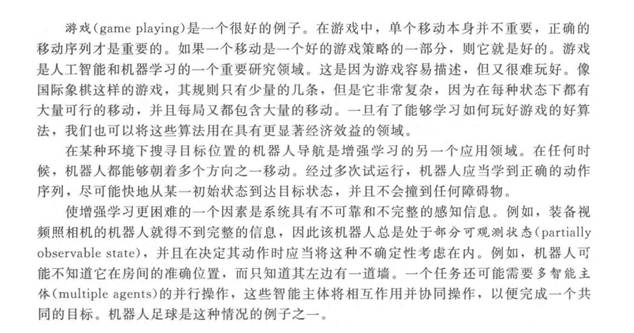
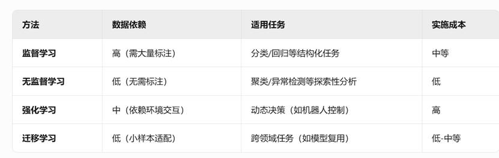

1、最特殊的假设

"环境稳定性"——存储的知识必须适用于未来情况

2、增强学习

增强学习：机器学习程序评估策略的好坏，并从以往的动作序列中学习，以便产生最优策略。

 

|      |                           |
| ---- | ------------------------- |
|      |  |

举例：游戏，机器人导航等

3、最好的泛化

“最好的泛化”并非单一技术或方法，而是指模型在未见数据上保持高精度与强鲁棒性的能力，其核心在于平衡模型对训练数据的拟合能力与对新数据的适应能力。

4、样本的协方差矩阵计算

5、不同的机器学习方法之间的区别

 

|      |                           |
| ---- | ------------------------- |
|      |  |

6、PCA中每一个主成分的确定

7、每一种降维方法的特点

8、使用欧式距离的假设

9、对于不能学习模型的算法，如果有新的数据，需要重新运行算法，如没有替代的解决方法

10、k 均值算法与期望极大化算法的联系与区别

11、把均方误改写成用偏倚和方差表示

12、支持度和置信度的计算

13、给出样本数据，用朴素贝叶斯方法分类