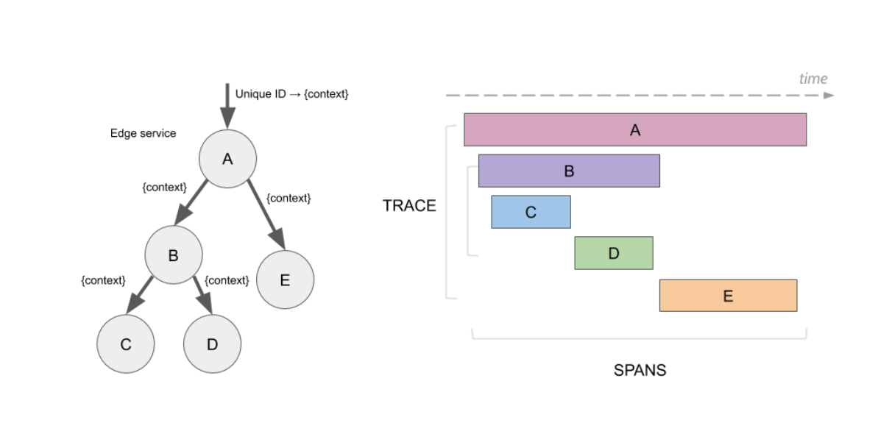
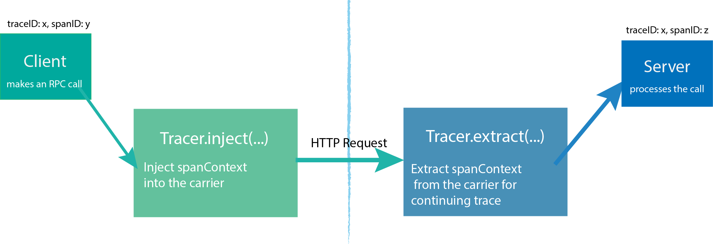
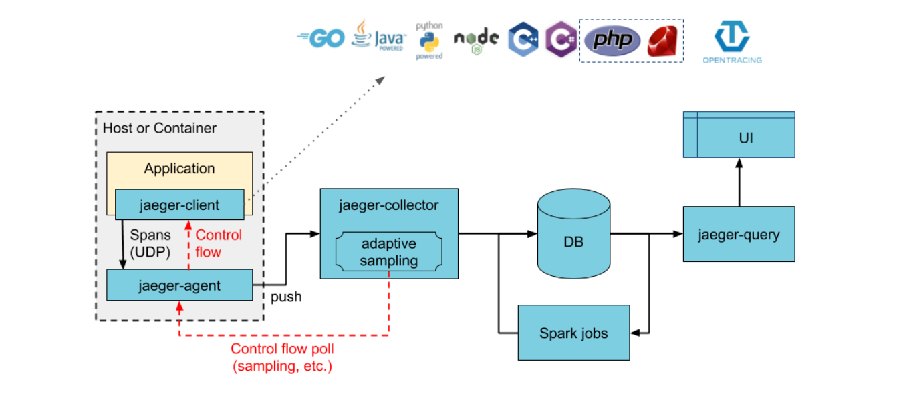
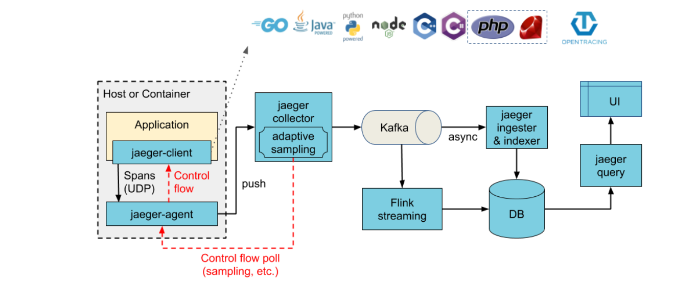
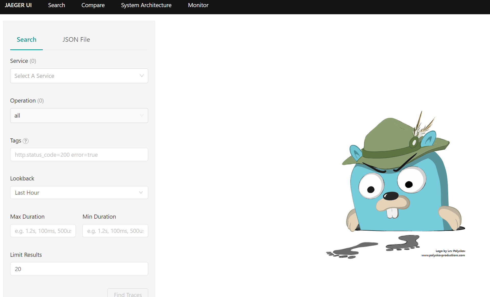
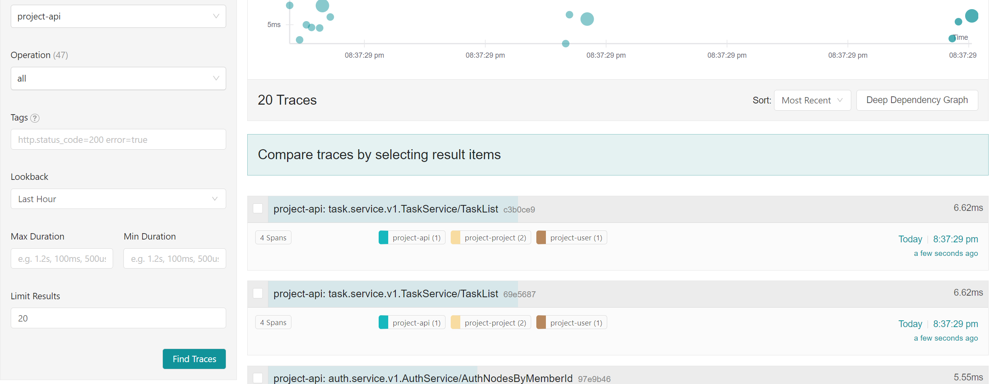

# 什么是链路追踪

分布式链路追踪就是将一次分布式请求还原成调用链路，将一次分布式请求的调用情况集中展示，比如各个服务节点上的耗时、请求具体到达哪台机器上、每个服务节点的请求状态等等。

**链路跟踪主要功能：**

- **故障快速定位**：可以通过调用链结合业务日志快速定位错误信息。
- **链路性能可视化**：各个阶段链路耗时、服务依赖关系可以通过可视化界面展现出来。
- **链路分析**：通过分析链路耗时、服务依赖关系可以得到用户的行为路径，汇总分析应用在很多业务场景。

### Jaeger

[Jaeger](https://www.jaegertracing.io/) 是一个分布式追踪系统。Jaeger的灵感来自 [Dapper](https://research.google.com/pubs/pub36356.html) 和 [OpenZipkin](https://zipkin.io/)，是一个由 Uber 创建并捐赠给 [云原生计算基金会（CNCF）](https://cncf.io/) 的分布式跟踪平台。它可以用于监控基于微服务的分布式系统：

- 分布式上下文传递
- 分布式事务监听
- 根因分析
- 服务依赖性分析
- 性能/延迟优化

#### Span

一个 Span 表示 Jaeger 的逻辑工作单元，Span 具有**操作名称，操作的开始时间，和持续时间**。Span 可以嵌套并排序以建立因果关系模型。

Span 由以下信息组成：

- An operation name：操作名称，必有；
- A start timestamp：开始时间戳，必有；
- A finish timestamp：结束时间戳，必有；
- Span Tags.：Key-Value 形式表示请求的标签，可选；
- Span Logs：Key-Value 形式表示，记录简单的、结构化的日志，必须是字符串类型，可选；
- SpanContext ：Span上下文，在不同的 span 中传递，建立关系；
- References：引用的其它 Span；

span 之间如果是父子关系，则可以使用 SpanContext 绑定这种关系。父子关系有 **`ChildOf`**、**`FollowsFrom`** 两种表示，**`ChildOf`** 表示 父 Span 在一定程度上依赖子 Span，而 **`FollowsFrom`** 表示父 Span 完全不依赖其子Span 的结果。

例如：

~~~json
{
    "traceID": "790e003e22209ca4",
    "spanID": "4b73f8e8e77fe9dc",
    "flags": 1,
    "operationName": "print-hello",
    "references": [],
    "startTime": 1611318628515966,
    "duration": 259,
    "tags": [
        {
            "key": "internal.span.format",
            "type": "string",
            "value": "proto"
        }
    ],
    "logs": [
        {
            "timestamp": 1611318628516206,
            "fields": [
                {
                    "key": "event",
                    "type": "string",
                    "value": "WriteLine"
                }
            ]
        }
    ]
}
~~~

####  Trace

一个 Trace 标识通过系统的数据或执行路径，Trace 可被认为是由**一组 Span 定义的有向无环图(DAG)**。

在OpenTracing 模型中，有三个主要的对象：

- Tracer
- Span
- SpanContext

`Tracer`可以创建`Spans`并了解如何跨流程边界对它们的元数据进行`Inject`（序列化）和`Extract`（反序列化）。它具有以下功能：

- 开始一个新的 `Span`
- `Inject`一个`SpanContext`到一个载体
- `Extract`一个`SpanContext`从载体

> 在Jaeger中，由起点进程创建一个 Tracer，然后启动进程发起请求，每个动作产生一个 Span，如果有父子关系，Tracer 可以将它们关联起来。当请求完成后， Tracer 将跟踪信息推送到 Jaeger-Collector中。

####  组件

Jaeger 可以使用 **all-in-one** 二进制（其中所有 Jaeger 后端组件都在单个进程中运行）进行部署，也可以作为可扩展的分布式系统进行部署，如下所述。有两个主要的部署选项：

* 收集器直接写入存储。

  

* 收集器写入 Kafka 作为中间缓冲。

  

##### 2.2.3.1 代理（Agent）

Jaeger **代理** 是一个**网络守护程序**，它侦听通过 UDP 发送的 span，然后将其分批发送给**收集器（Collector）**。它旨在**作为基础组件部署到所有主机**。该代理为客户端**抽象了收集器的路由和发现**。

##### 2.2.3.2 收集器（Collector）

Jaeger 收集器从 Jaeger代理或者SDK接收Trace，通过a processing pipeline对Trace做验证，清理，压缩等，并最终存储它们。

Jaeger 的存储是一个可插拔组件，支持 Cassandra，Elasticsearch 和 Kafka等。

##### 2.2.3.3 查询（Query）

**查询**是一项从存储中检索Trace并托管 UI 来显示Trace的服务。

##### 2.2.3.4 Ingester

**Ingester** 是一项从 Kafka topic 读取并写入另一个存储后端（Cassandra，Elasticsearch）的服务。

### 2.3 使用

#### 2.3.1 部署Jaeger

简单起见，使用all-in-one的方式部署

~~~env
MYSQL_VERSION=8.0.20
MYSQL_DIR=D:/go/project/msproject-data/mysql
MYSQL_PORT=3309
REDIS_VERSION=6.2.7
REDIS_PORT=6379
REDIS_DIR=D:/go/project/msproject-data/redis
ETCD_VERSION=3.5.6
ETCD_PORT=2379
ETCD_DIR=D:/go/project/msproject-data/etcd
NACOS_DIR=D:/go/project/msproject-data/nacos
JAEGER_DIR=D:/go/project/msproject-data/jaeger
BADGER_EPHEMERAL=false
~~~

~~~yaml
Jaeger:
    container_name: jaeger
    image: jaegertracing/all-in-one:1.41
    restart: always
    environment:
      - COLLECTOR_ZIPKIN_HTTP_PORT=9411
      - SPAN_STORAGE_TYPE=badger
      - BADGER_EPHEMERAL=${BADGER_EPHEMERAL}
      - BADGER_DIRECTORY_VALUE=/badger/data
      - BADGER_DIRECTORY_KEY=/badger/key
    privileged: true
    volumes:
      - ${JAEGER_DIR}:/badger
    ports:
      - 5775:5775/udp
      - 6831:6831/udp
      - 6832:6832/udp
      - 5778:5778
      - 16686:16686
      - 14268:14268
      - 14269:14269
      - 9411:9411
~~~

访问：http://localhost:16686/search

#### 2.3.2 gin中间件

~~~go
go get go.opentelemetry.io/otel
go get go.opentelemetry.io/otel/sdk
go get go.opentelemetry.io/contrib/instrumentation/github.com/gin-gonic/gin/otelgin
go get go.opentelemetry.io/contrib/instrumentation/google.golang.org/grpc/otelgrpc
go get -u go.opentelemetry.io/otel/exporters/jaeger
go get github.com/grpc-ecosystem/go-grpc-middleware
~~~

~~~go
package tracing

import (
	"go.opentelemetry.io/otel/exporters/jaeger"
	"go.opentelemetry.io/otel/sdk/resource"
	sdktrace "go.opentelemetry.io/otel/sdk/trace"
	semconv "go.opentelemetry.io/otel/semconv/v1.4.0"
)

func JaegerTraceProvider() (*sdktrace.TracerProvider, error) {
	exp, err := jaeger.New(jaeger.WithCollectorEndpoint(jaeger.WithEndpoint("http://localhost:14268/api/traces")))
	if err != nil {
		return nil, err
	}
	tp := sdktrace.NewTracerProvider(
		sdktrace.WithBatcher(exp),
		sdktrace.WithResource(resource.NewWithAttributes(
			semconv.SchemaURL,
			semconv.ServiceNameKey.String("project-project"),
			semconv.DeploymentEnvironmentKey.String("dev"),
		)),
	)
	return tp, nil
}

~~~

~~~go
tp, tpErr := tracing.JaegerTraceProvider()
	if tpErr != nil {
		log.Fatal(tpErr)
	}
	otel.SetTracerProvider(tp)
	otel.SetTextMapPropagator(propagation.NewCompositeTextMapPropagator(propagation.TraceContext{}, propagation.Baggage{}))
	
~~~

gin中间件：

~~~go
r.Use(otelgin.Middleware("project-api"))
~~~

grpc：

~~~go
conn, err := grpc.Dial(
		"etcd:///user",
		grpc.WithTransportCredentials(insecure.NewCredentials()),
		grpc.WithUnaryInterceptor(otelgrpc.UnaryClientInterceptor()),
	)
~~~

~~~go
	s := grpc.NewServer(
		grpc.UnaryInterceptor(grpc_middleware.ChainUnaryServer(
			otelgrpc.UnaryServerInterceptor(),
			//interceptor.New().CacheInterceptor(),
		)),
	)
~~~

